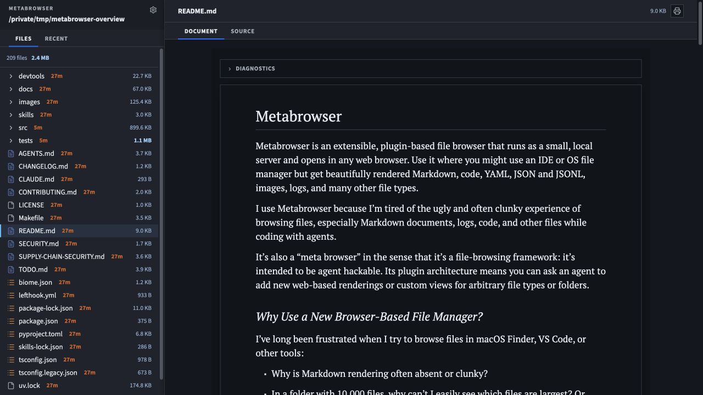

# Metabrowser

Metabrowser is an extensible, plugin-based file browser that runs as a small, local
server and opens in any web browser.
Use it where you might use an IDE or OS file manager but get beautifully rendered
Markdown, code, YAML, JSON and JSONL, images, logs, and many other file types.

I use Metabrowser because I’m tired of the ugly and often clunky experience of browsing
files, especially Markdown documents, logs, code, and other files while coding with
agents.

It’s also a “meta browser” in the sense that it’s a file-browsing framework: it’s
intended to be agent hackable.
Its plugin architecture means you can ask an agent to add new web-based renderings or
custom views for arbitrary file types or folders.

## Use With Coding Agents

Metabrowser ships a portable [Agent Skill](skills/metabrowser/SKILL.md) so a coding
agent can browse directories, open files, inspect live logs, and validate plugins on
your behalf.

**Install the skill with one command:**

```shell
npx skills add jlevy/metabrowser --skill metabrowser
```

**Nothing else to install.** The skill prefers a locally installed `metab` and otherwise
falls back to `uvx metabrowser@latest`, so it needs no persistent Metabrowser
installation. It uses `--help` on the CLI as the source of truth.
Release cool-off stays a uv configuration concern rather than a version frozen in the
skill; see the [installation guide](docs/installation.md).

## Why Use a New Browser-Based File Manager?

I’ve long been frustrated when I try to browse files in macOS Finder, VS Code, or other
tools:

- Why is Markdown rendering often absent or clunky?
- In a folder with 10,000 files, why can’t I easily see which files are largest?
  Or which have been modified recently?
- Why is it so hard to tail log files in a GUI?
- How can I cleanly browse a large YAML, JSON, or JSONL file?
- Do I really have to register customized default apps for every file extension in macOS
  or Windows?
- If I want a graphical rendering for a new language or file format, do I really need to
  ship an entire VS Code extension or a new Electron app?

Metabrowser combines a simple Starlette Python server with a navigator-style web
interface.

Unlike a typical local web view, it’s live and efficient about watching for updates from
lots of files. The server watches the file tree in the background and streams updates to
the frontend.

It especially works well when browsing technical documentation and other Markdown.
It supports clean typography and full-featured Markdown rendering via
[KPress](https://github.com/jlevy/kpress).

It aims to be the most readable way to view any common file and is my preferred way to
read Markdown docs.

## Features

- **Complete Markdown support.** Good typography, tables, footnotes, syntax
  highlighting, math, links, images, and print-friendly output (supported via
  [kpress](https://github.com/jlevy/kpress)).

- **Repository-native document links.** Relative and served-root Markdown links use the
  same exact path semantics as GitHub, including headings, spaces, Unicode, images, and
  other local resources.
  Obsidian wiki links add deterministic note, heading, named-block, attachment, and
  media navigation, plus bounded whole-note, heading, and block transclusion with
  visible missing or ambiguous states instead of guessed paths.
  Each selected file has a reloadable `/view/<path>` URL, so native new-tab, copy-link,
  and browser history behavior works without configuration.

- **Broad file support.** Render common text, syntax highlighted source code, logs,
  images, and tree-parsed JSON, JSONL, and YAML. Clean support for YAML frontmatter.

- **Scalable browsing of large file trees.** Unlike a Finder or IDE/VSCode tree, the
  file and recent views keep file ages, file and folder counts, and aggregate disk usage
  visible while you browse.
  And the streaming architecture easily scales to 100,000 files or more in a folder.

- **Folder overviews with exact file tallies.** Every directory opens with a compact
  Files summary that compares file counts and byte totals, percentages, and normalized
  bars across semantic groups such as Code, Documentation, Data, Archives, Media, and
  Other. Expand a family such as Log files to inspect exact extensions, or inspect
  bounded No extension and Other types details without losing the conserved total or
  ignored-file subset.

- **A visual Treemap for every folder.** Size the same live file hierarchy by bytes or
  file count, include or exclude ignored files, and move through nested folders without
  leaving the Treemap.
  Colors and file identities stay consistent with Overview and the navigation filters.

- **Git history and diffs.** Browse a repository’s commit graph beside the file tree,
  open any commit at its own `/commit/<rev>` URL, and read its changes through the same
  renderer that opens `.patch` and `.diff` files: per-file sections with GitHub-style
  change indicators, numbered hunks, and long rewrites folded behind an expander.
  `metab ROOT --diff BASE..TARGET` answers the same question from a terminal, and
  `--diff-check` replays a change set against the base tree to prove it reproduces the
  target exactly.

- **Quick File navigation.** Press `/` or `T` to open a fuzzy finder over every
  non-gitignored file under the root, then jump straight to it by name or path fragment.

- **Built-in keyboard Help.** Press `?` or use the visible Help control for a concise
  explanation, the project link, and the complete shortcut list.
  A persistent hint strip keeps Help and Quick File discoverable and adds contextual
  commands while you work in the file tree.

- **Accessible file-tree navigation.** Move through the tree with the arrow keys, jump
  with Home and End, and activate folders, files, or pagination with Enter or Space.
  Focus, selection, expansion, and dynamic tree updates stay synchronized.

- **A fast, framework-free frontend.** Metabrowser ships direct CSS and JavaScript with
  no browser framework.
  Rendering is quick even for large files and customization is straightforward.

- **Custom rendering for arbitrary file types.** A compact manifest-based plugin
  architecture adds file matching and browser views, with optional Python data hooks and
  JSONL adapters, without changing Metabrowser core.

It doesn’t currently support editing (or commenting on Markdown docs), but it could in
the future.

Metabrowser is also a candidate producer and consumer of the reusable
[File Rollup Format v0.1](docs/project/architecture/file-rollup-format/file-rollup-format.md),
which defines portable file-type registries and conserved directory statistics.
The format is application-independent and is intended to be usable by other inventory
tools, including [`fdu`](https://github.com/jlevy/fdu).

## Quick Start

Metabrowser requires Python 3.12 or newer and uses [uv](https://docs.astral.sh/uv/).
Node.js and npm are not required to install or run it.
Run the latest published release without installing a global tool:

```shell
uvx metabrowser@latest .
```

This will open the current directory (or any other directory you specify) in your web
browser.

[](images/metabrowser-overview.jpg)

To make Metabrowser available everywhere as `metab`:

```shell
uv tool install metabrowser
metab .
```

`metab` is the standard installed command.
The `metabrowser` compatibility command matches the package name, which is why the short
`uvx metabrowser@latest ...` form works.

The CLI is one flat command: serving is the default operation, and every other operation
is a mode flag documented in one place:

```shell
metab --help
```

See [installation](docs/installation.md) for uv setup and upgrade instructions.

To run an unreleased source checkout, install its exact locks and invoke the local
environment without resolving them again:

```shell
make install
uv --config-file uv.toml run --frozen metab ./path/to/directory
```

> [!WARNING]
> Metabrowser is not a secure, public-facing web server.
> It is a local tool for trusted users browsing files locally or via trusted channels
> like ssh. Treat it with the same level of trust you would a shell or OS file manager.
> Use the default `127.0.0.1` binding, load only trusted plugins, and never expose
> Metabrowser directly to the internet.

## What Metabrowser Opens

Built-in plugins provide views for:

- Markdown rendered by KPress, alongside the source.
- JSON, YAML, and other structured documents.
- JSONL streams, with timelines and chart summaries for supported event formats,
  including coding-agent logs.
- Text, source code, images, and binary-file metadata.

Gzip and zlib variants of supported files open transparently with bounded decompression.
Format-specific binary stores belong in separately installed plugins, keeping native
readers out of the core package.

Large trees are indexed in the background.
The first preview does not wait for a full recursive crawl, and filesystem events update
the tree and recent-file views while the server runs.

## Common Commands

`metab ROOT` starts the local server, opens the browser, and serves the selected root,
the way `open` opens a folder on macOS. Mode flags select every other operation:

```shell
# Browse a directory or open one file directly.
metab ./path/to/directory
metab ./path/to/directory/example.txt

# Select a file relative to the served root.
metab ./path/to/directory --path documents/report.pdf

# Start without opening a browser window.
metab ./path/to/directory --no-open

# Browse a directory on a remote host through an SSH tunnel.
metab --remote example-host --path /srv/shared-files

# Print a machine-readable inventory without starting the web UI.
metab ./path/to/directory --walk --format json

# Check the navigation APIs without opening a browser or port.
metab ./path/to/directory --check-api
```

The server binds to `127.0.0.1:8411` by default and walks a bounded port range if that
port is occupied.
Do not change `--host` to expose a served root to an untrusted network;
see the [security policy](SECURITY.md).
For a stable diagnostic transcript of tree loading, Live filtering, and clearing the
filter, see [real-time debugging](docs/realtime-debugging.md).

## Plugins

Metabrowser is designed to be extended.
A plugin can add:

- File-kind matching rules.
- Browser preview tabs implemented in JavaScript.
- Optional Python data hooks for installed plugin packages.
- JSONL event adapters for additional log formats.

Inspect the complete registry and validate every discovered plugin from the CLI:

```shell
metab --plugins
metab --plugins --json
metab --plugin markdown
metab --doctor
```

Metabrowser loads plugins only from trusted sources:

1. built-ins shipped in the Metabrowser wheel
2. installed Python packages registered in the `metabrowser.plugins` entry-point group
3. directories explicitly named with `--plugins-dir` or `METABROWSER_PLUGINS_DIRS`

An installed Python plugin must be present in the same uv tool or uvx environment as
Metabrowser. Operator-directory plugins are useful for local JavaScript-only extensions.

For example, load an operator-reviewed plugin directory with:

```shell
metab ./path/to/directory --plugins-dir ./trusted-plugins
```

The served data tree is never an implicit plugin source.
See the [plugin authoring guide](docs/plugins.md) for the manifest schema, browser SDK,
packaging, lifecycle rules, and security boundary.

## Develop

Development requires uv 0.11.26 or newer, Node 24.18 or newer on the Node 24 LTS line,
and npm 11.10 or newer on npm 11. The Node and npm requirements apply only to repository
tooling.

The repository uses uv, Ruff, BasedPyright, pytest, Biome, TypeScript check-JS, and
Flowmark:

```shell
make install
make format
make verify
```

`make verify` checks formatting, lint, types, tests, locked dependency audits, source
and wheel builds, artifact inspection, and isolated installed-wheel smoke tests.
See [development](docs/development.md) and [architecture](docs/architecture.md).

## Documentation

Using Metabrowser:

- [Installation](docs/installation.md) — uv setup, upgrades, and the agent skill
- [Changelog](CHANGELOG.md) — what changed in each release
- [Roadmap](TODO.md) — what is planned next

Extending it:

- [Plugin authoring](docs/plugins.md) — manifest schema, browser SDK, and data hooks
- [Architecture](docs/architecture.md) — request flow, URL grammar, and plugin
  boundaries
- [Design system](docs/design-system.md) — tokens, layout bands, and component rules
- [File Rollup Format v0.1](docs/project/architecture/file-rollup-format/file-rollup-format.md)
  — the shared file-type and rollup contract
- [File Diff Format v1](docs/project/architecture/file-diff-format/file-diff-format.md)
  — the shared change-set model behind every diff view
- [Rendering large content](docs/large-content-rendering.md) — the cost model and limit
  rules every content view shares

Working on it:

- [Contributing](CONTRIBUTING.md) — how to propose and land a change
- [Development](docs/development.md) — everyday commands and the `make verify` gate
- [End-to-end testing](docs/e2e-testing.md) — which test layer proves what
- [Real-time debugging](docs/realtime-debugging.md) — a stable transcript of tree and
  filter behavior
- [Publishing](docs/publishing.md) — the tag-driven release path
- [Project design and plans](docs/project/README.md) — specs, research briefs, and
  architecture notes

Policies:

- [Security policy](SECURITY.md) — reporting and the served-root trust boundary
- [Supply-chain security](SUPPLY-CHAIN-SECURITY.md) — dependency review and the cool-off
  rules

## License

AGPL-3.0-or-later; see [`LICENSE`](LICENSE). Vendored components and their licenses are
listed in [`NOTICE.md`](NOTICE.md).

<!-- This document follows common-doc-guidelines.md.
See github.com/jlevy/practical-prose and review guidelines before editing.
-->
