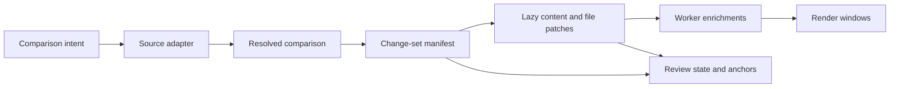

# Research: Web Diff Viewer Architecture and Intermediate Representations

**Date:** 2026-07-17 (last updated 2026-07-17)

**Author:** Joshua Levy with OpenAI Codex research assistance

**Status:** Complete

## Overview

Metabrowser can support committed Git history, staged changes, unstaged changes, all
uncommitted changes, imported patches, and eventually Jujutsu changes through one
viewer. It should not make Git’s patch text, the browser DOM, or any particular frontend
library its system-wide data model.

The central recommendation is a layered architecture:

1. A source adapter resolves a comparison request into explicit, stable snapshots.
2. A versioned, source-neutral change-set manifest describes files and content
   identities without eagerly computing or transferring every patch.
3. File content and semantic hunks are fetched lazily and carry completeness, encoding,
   and provenance metadata.
4. Browser workers add syntax tokens, intraline spans, moved-code information, or
   structural analysis without changing the canonical change set.
5. The renderer virtualizes only when necessary and keeps review state separate from
   source state.

The first implementation should be a read-only installed plugin backed by the system
`git` executable.
This gives exact Git semantics, avoids a new native distribution on day
one, and fits Metabrowser’s existing plugin boundary.
The protocol should make it possible to replace the Git subprocess adapter with a Rust
helper based on `gix` and `imara-diff` after benchmarks show that repository discovery
or line diffing is the bottleneck.
Jujutsu should be a separate adapter to the same IR, not emulated as a slightly unusual
Git repository.

For the web renderer, `@pierre/diffs` is the strongest current foundation to prototype.
It has a vanilla JavaScript API, Shiki-based highlighting, worker pools, annotations,
split and unified views, and a virtualization-first multi-file `CodeView`. It is also
used by the inspected Codex desktop release.
Its current API and release maturity still warrant a pinned, benchmarked spike.
GitHub’s 2026 diff work provides the best complementary lesson: simplify each row,
progressively load file bodies, and virtualize only very large reviews so native find,
copy, print, and accessibility remain intact for ordinary changes.

## Scope

This review covers diff acquisition, source-state detection, comparison semantics,
intermediate representations, transport, web rendering, performance, accessibility,
security, extensibility, and testing.
It compares hosted review products, desktop and local tools, JavaScript renderer
libraries, Git-native implementations, Jujutsu, Rust libraries, and syntax-aware diff
tools.

The first implementation is read-only and local.
Patch application, staging, unstaging, committing, conflict resolution, hosted-review
synchronization, and a general-purpose editor are future capabilities.
The architecture should preserve the information those features would need without
granting mutation authority now.

## Conclusions

The major conclusions are:

- Model comparisons between snapshots, not commands or human labels.
  `HEAD`, the index, the working tree, two commits, two pull-request versions, and two
  Jujutsu changes all resolve differently.
- Preserve the two Git edges `HEAD -> index` and `index -> working tree`. An
  `HEAD -> working tree` view is useful, but it cannot explain partial staging by
  itself.
- Use unified Git patch as an import/export and compatibility format, not as the
  canonical IR. It is convenient but incomplete and awkward to page safely.
- Return a small manifest first and fetch per-file bodies lazily.
  Lazy DOM mounting after downloading and parsing one huge patch solves only the
  rendering portion of the performance problem.
- Make partiality explicit.
  A file or change set can be complete, collapsed, deferred, binary, too large, timed
  out, stale, or unsupported.
  Empty content must never ambiguously mean one of those states.
- Keep byte identities and display projections separate.
  Git paths and blob contents are bytes; JavaScript strings and JSON are Unicode.
- Keep semantic diff data separate from recomputable enrichment and ephemeral render
  layout. Syntax themes, tokenizers, line wrapping, and viewport measurements should not
  invalidate the source comparison.
- Use a safe Git subprocess adapter first.
  Treat configured external diff tools and text-conversion programs as executable code
  and disable them unless the user explicitly trusts the repository and opts in.
- Treat Rust as a measured optimization and capability step.
  `gix` is the best fit for repository semantics, and its use in GitButler provides a
  relevant production example.
  `imara-diff` is a strong focused content-diff engine.
- Treat Jujutsu as a design input and a first-class future source.
  Its lazy tree-diff stream, operation identity, change-to-change `interdiff`, copy
  records, and n-way conflicts expose concepts that a Git-patch-only model would lose.

## Comparison Semantics

A diff viewer compares states; Git commands are only one way to obtain those states.
The request model should therefore name both the user’s intent and the resolved
endpoints.

### Git Working States

Git has three relevant local layers:

```text
HEAD tree  --staged-->  index  --unstaged-->  working tree
```

The useful views are distinct:

| User view | Left state | Right state | Typical Git operation | Important caveat |
| --- | --- | --- | --- | --- |
| Staged | `HEAD` tree | Index | `git diff --cached HEAD` | An unborn branch has no `HEAD` tree. |
| Unstaged | Index | Working tree | `git diff` | Does not include untracked files by default. |
| All uncommitted | `HEAD` tree | Working tree | `git diff HEAD` plus untracked synthesis | Hides which portions are staged. |
| One commit | Parent tree | Commit tree | `git diff C^ C` | Root and merge commits need explicit policy. |
| Two revisions | Tree A | Tree B | `git diff A B` | Symbolic names must be resolved before caching. |
| Topic versus base | Merge-base tree | Topic tree | `git diff A...B` | Different from direct two-endpoint comparison. |
| Merge commit | One or more parent trees | Merge tree | Per-parent or combined diff | Combined patch is not an ordinary two-sided hunk. |
| Conflict | Index stages and working file | Resolution state | Status plus index stages 1, 2, and 3 | Conflict markers are a materialization, not the conflict itself. |

An all-uncommitted view should retain the component-edge information when it is
available.
A file may have both staged and unstaged changes, and the UI should be able to
badge or filter them even while rendering the direct `HEAD -> working tree` result.

Untracked files are not an ordinary Git diff entry.
The adapter should discover them through stable status output and represent each as an
addition from a synthetic empty state.
It must apply file-size, ignore, safe-path, and binary limits before reading the file.
Intent-to-add entries, sparse checkouts, submodules, and symlinks require their own
flags rather than pretending they are regular text files.

The acquisition layer should use the stable, NUL-delimited forms described by
[`git status --porcelain=v2 -z`](https://git-scm.com/docs/git-status) and
[`git diff --raw -z` or `--numstat -z`](https://git-scm.com/docs/diff-format).
Porcelain v2 carries the `HEAD`, index, and working-tree modes and object IDs, rename
scores, unmerged stages, and independent staged and unstaged status codes.
Human formatted status output is not an API.

### Historical and Hosted Comparisons

Historical views need an explicit parent policy:

- A normal commit defaults to its first parent.
- A root commit compares against the empty tree.
- A merge commit offers first-parent, any specific parent, and a multi-parent or
  combined view. The first version may support only per-parent two-way views, but the IR
  must report that a multi-parent comparison was requested or omitted.
- Branch and pull-request views record whether they use direct endpoints, a merge base,
  or a provider-computed synthetic merge result.
  GitHub pull requests use a three-dot comparison, while a commit page is a
  parent-to-commit comparison.
- Hosted review versions are immutable provider identifiers even when their branch names
  move. Review state must anchor to those resolved versions.

Graphite’s most important contribution is not a new line renderer.
It makes pull request versions and the comparison between versions first-class.
Its “hide reviewed changes” view compares the last reviewed version with the newest
version. That is a change-evolution view, not merely another choice of branch names.
Jujutsu’s `interdiff` goes further by comparing what two changes do even when they have
different parents.

The comparison intent should consequently include a `comparisonKind` such as `content`,
`changeEvolution`, or `multiParent`, plus an explicit base policy such as `direct`,
`mergeBase`, `firstParent`, or `selectedParent`.

### Jujutsu Working States

Jujutsu does not have Git’s public staging-area workflow.
Its working copy is a commit, normally `@`, and commands ordinarily snapshot
working-copy changes before they run.
`--ignore-working-copy` trades freshness for avoiding that mutation.
The adapter must record the Jujutsu operation ID and the resolved commit and tree IDs so
a response cannot silently combine states from two operations.

Jujutsu offers several useful architectural precedents:

- `MergedTree::diff_stream()` returns an asynchronous stream of path-level
  `TreeDiffEntry` values.
  The stream can hide high-latency storage and need not load every file body.
- Copy records decorate tree-diff entries rather than being inferred by the renderer.
- `ContentDiff` and `DiffHunk` operate on byte strings and support more than two input
  sides.
- Conflicts are logical n-way values in commits.
  Materialized conflict markers are a presentation for a working file or tool, not the
  source of truth.
- `jj interdiff` compares changes by rebasing the older change onto the newer change’s
  parents before comparing it with the newer change.
- External diff tools receive materialized left and right directory trees, showing that
  a snapshot-pair contract can support non-Git tools.

The initial Jujutsu adapter can invoke `jj` and normalize its Git-format diff plus a
separate manifest. A durable JSON or template-based machine format would be better than
scraping colored or human output.
Embedding `jj_lib` should wait until its API, release cadence, binary size, and
repository compatibility are acceptable for a shipped native helper.

## The Intermediate Representation

The system needs several representations because source semantics, transport, analysis,
and layout have different stability and cost.
A single giant schema would couple them and make caches invalid for unrelated reasons.



### Layer 1: Comparison Intent

`ComparisonIntent` is a user request, not a cache key.
It includes:

- The repository or provider source.
- The requested mode: staged, unstaged, all uncommitted, two revisions, a revision
  versus its parent, merge-base, imported patch, or change evolution.
- Symbolic selectors such as `HEAD`, a branch, a Jujutsu revset, or a hosted review
  version.
- Path filters, include-untracked policy, whitespace policy, context size, rename and
  copy policy, diff algorithm, and parent policy.
- Trust-sensitive options such as text conversion or an external diff driver.
- Requested limits and client capabilities.

This object is safe to log after repository paths have been sanitized, but it is not
stable because symbolic selectors and the working tree can move.

### Layer 2: Resolved Comparison

`ResolvedComparison` freezes as much identity as the source can provide:

- A schema version, backend name and version, repository identity, and comparison kind.
- Resolved left and right snapshot descriptors.
  Git snapshots carry commit, tree, or blob IDs; an index snapshot carries an index
  fingerprint; Jujutsu carries operation, commit, and tree IDs; a hosted source carries
  provider version IDs.
- A worktree generation, watcher sequence, or bounded snapshot ID for volatile files.
- The effective merge base, parent selection, pathspec, whitespace behavior, rename
  settings, algorithm, attributes policy, and trust policy.
- A deterministic comparison ID and cache fingerprint.
- Capability flags and warnings for unsupported combined diffs, conflicts, filters, or
  path encodings.

Historical object IDs are immutable.
Index and working-tree comparisons are not.
A first version can use an optimistic generation token derived from the watcher
sequence, index identity, and relevant file metadata, then hash each file body as it is
read. If the generation changes during a request, return `stale` and prompt a refresh.
A future bounded content-addressed worktree snapshot can offer stronger consistency for
reviews that must remain stable while files change.

### Layer 3: Change-Set Manifest

`ChangeSetManifest` is the first browser response.
It should stay small enough to return before line diffing and highlighting.
It contains totals, partiality, ordering, and one `FileChange` for every discovered
path.

Each `FileChange` needs:

| Field group | Required information |
| --- | --- |
| Identity | Stable file-change ID, old and new lossless path IDs, display paths, old and new content references |
| Classification | Added, deleted, modified, renamed, copied, mode change, type change, unmerged, submodule, binary, or unsupported |
| Git or VCS state | Old and new modes, object IDs when known, similarity score, index/worktree provenance, parent sides |
| Size and cost | Old and new byte sizes, estimated lines, additions/deletions if already computed, generated/vendor flags |
| Availability | Patch deferred, ready, collapsed, binary, too large, timed out, failed, or stale |
| Presentation hints | Detected language, rich-view capability, default collapse reason, risk or ownership metadata supplied by an extension |

Totals must say whether they are exact or estimated.
Computing line statistics can cost a significant portion of computing the patches
themselves, as GitButler’s `gix` implementation notes.
The initial response should not block on exact additions and deletions when the source
cannot provide them cheaply.

Manifest pagination is useful for hosted sources, but a local repository usually
benefits from returning all lightweight file records.
The response still needs hard caps and a continuation cursor for pathological
repositories.

### Layer 4: Content References and Semantic File Patches

`ContentRef` identifies a file side without requiring it to be inline:

- Source kind: Git object, index object, worktree snapshot, Jujutsu file value, provider
  blob, empty, or inline imported content.
- Content identity: object ID or content digest, plus the source generation for volatile
  content.
- Entry kind, byte size, encoding status, line-ending summary, binary status, and
  completeness.
- A bounded endpoint or opaque token for retrieving raw bytes or a decoded text
  projection.

`FilePatch` is a semantic, JSON-compatible representation of one file comparison.
It contains old and new ranges, hunk function context, ordered context/add/delete
groups, line records, end-of-file newline markers, and references to the source content.
It also records the diff producer, algorithm, whitespace behavior, context size, and
whether the patch is complete.

The canonical coordinate system should be line number plus byte offset into the original
side. Browser-facing projections may add UTF-16 offsets for DOM APIs and grapheme
boundaries for user selection.
They must identify the conversion used.
Review anchors and syntax tokens cannot safely assume that a Unicode code point, a
UTF-16 code unit, and a byte are the same position.

Git permits arbitrary non-NUL bytes in path components.
A lossless path value should therefore contain raw bytes encoded for JSON, normally
base64, and a separately escaped display string.
A display string must never be sent back as the authority for opening a file.
GitButler uses both a frontend display path and a byte-preserving path field; that is
the right general pattern.

The system may attach the original unified file patch for diagnostics, download, or a
library adapter. It should not need to reparse that string to recover information the
backend already knew.

### Layer 5: Enrichments

Enrichments are derived, replaceable, and independently cached:

- Syntax-token spans with language, grammar, highlighter, theme-independent scope or
  style identity, and producer version.
- Intraline word or character spans.
- Moved-block matches.
- Structural or AST changes.
- Generated-code, ownership, dependency, security, or semantic-analysis annotations.
- Rich previews for Markdown, images, notebooks, or structured data.

Every enrichment is keyed by immutable content IDs and options.
It may be unavailable, timed out, or truncated without invalidating the textual patch.
Theme-specific Shiki output is best produced in a browser worker and bounded by maximum
file and line lengths.
Plain text should appear before highlighting completes.

Difftastic demonstrates the value of syntax-aware comparison: it parses both files with
tree-sitter and aligns syntax nodes rather than lines.
It also documents the tradeoff: graph search can use substantial memory and perform
poorly when files are very different or contain many changes.
Structural comparison should therefore be an optional alternate enrichment or view,
never the only representation of a source change.

### Layer 6: Review State and Anchors

Viewed flags, collapse state, comments, selections, and navigation history do not belong
in the source patch.
A `ReviewAnchor` should include:

- Comparison and file-change IDs.
- Side and immutable content ID.
- Byte and line range.
- A normalized context fingerprint around the range.
- The originating hunk identity and source review version.
- Relocation status and confidence if a later comparison moves the line.

Line number alone is not stable when a pull request or working file changes.
Difit’s content hash for viewed files is a useful minimum.
Hosted review systems additionally need provider comment IDs, outdated-thread state, and
pending-review state.

### Layer 7: Render Windows

The render model is ephemeral browser state.
It includes flattened visible rows, stable row IDs, estimated and measured heights,
overscan, wrapping, sticky-header state, expanded-context cursors, focus, and scroll
anchors.
It is derived from the semantic patch and review annotations and should never be
persisted as the source record.

This separation lets a renderer switch between split and unified layouts, compact and
comfortable density, or virtualized and fully mounted modes without recomputing the
repository diff.

### Completeness and Errors

Every collection and expensive field should carry a status rather than relying on
missing values. A common envelope can use:

- `complete`: the requested result is present.
- `deferred`: available through a lazy request.
- `partial`: some result is present with a cursor or explicit omitted range.
- `collapsed`: deliberately not loaded automatically, but available.
- `binary` or `tooLarge`: use a specialized viewer or metadata.
- `unsupported`: the backend cannot represent the requested case.
- `timedOut`, `failed`, or `stale`: retry or refresh with a diagnostic code.

This is essential for honest totals, predictable caching, and a UI that distinguishes
“no changes” from “changes were not computed.”

## Backend Architecture

### Metabrowser Boundary

Metabrowser core is consumer-agnostic, while domain schemas, data routes, renderers,
tests, and styles belong in plugins.
A diff implementation needs Python data hooks, so it cannot begin as an
operator-directory JavaScript-only plugin.
The clean first home is an installed `metabrowser-diff` plugin using the documented
`window.metabrowser` SDK and `/api/plugin/<plugin>/<route>` boundary.

The plugin should reuse core safe-path, projection, gzip, watcher, and disposal helpers.
It should mount lazily as a non-default view and release workers, observers, caches, and
event streams when replaced.
Repository discovery could become a generic core capability later if multiple plugins
need it; Git-specific schemas should not.

### Initial Git Adapter

The system `git` executable is the recommended first backend because it is already the
semantic authority for the repository and honors its object format, index, attributes,
sparse checkout, and configuration.
It also avoids adding a Python or native Git implementation before there is benchmark
evidence.

The adapter should:

1. Resolve the repository root and symbolic revisions within the server’s allowed roots.
2. Resolve immutable commit and tree IDs before creating a comparison ID.
3. Use `git --no-optional-locks status --porcelain=v2 -z` for local-state discovery.
4. Use NUL-delimited raw or name-status output for the manifest, with a bounded rename
   policy.
5. Fetch or compute one file patch at a time with explicit pathspec termination and
   literal, byte-safe path handling.
6. Use a persistent
   [`git cat-file --batch-command --buffer -Z`](https://git-scm.com/docs/git-cat-file.html)
   process when object retrieval volume justifies it.
7. Synthesize untracked additions only after bounded safe-path and size checks.
8. Attach the actual options and object IDs to every result.

All commands need time, output, file-count, byte, and concurrency limits; cancellation;
sanitized environment variables; and preserved exception causes.
Git should run with no color, no pager, no prompts, no optional locks, no external diff,
and no text conversion by default.
Arguments must be passed as an array, never through a shell.

Git attributes can classify text and binary content, define word regexes and function
headers, and configure custom diff drivers.
They can also name external diff or text-conversion programs.
Those programs execute repository or user configuration and must be behind an explicit
trust decision. The safe default is `--no-ext-diff` and `--no-textconv`. A later trusted
mode can report which driver produced the content and that the result is a lossy display
projection.

The adapter should not refresh or write the index on a read path.
Git documents `--no-optional-locks` for background status operations.
File watching should invalidate a comparison, not mutate the index to make it current.

### API Shape

A practical HTTP shape is:

```text
POST /api/plugin/diff/comparisons
GET  /api/plugin/diff/comparisons/{comparison_id}
GET  /api/plugin/diff/comparisons/{comparison_id}/files/{file_id}/patch
GET  /api/plugin/diff/comparisons/{comparison_id}/files/{file_id}/content/{side}
GET  /api/plugin/diff/comparisons/{comparison_id}/events
```

The creation response contains the resolved comparison and manifest.
File IDs are opaque; raw paths do not appear in URL path segments.
Patch endpoints accept bounded context and whitespace options only if those options are
part of their cache key.
Content endpoints support byte ranges and correct content types.
SSE can reuse Metabrowser’s watcher model to report `stale`, replacement comparison IDs,
and newly available enrichments.

JSON is appropriate for the control plane and semantic manifest.
Large content should use streamed text or bytes.
NDJSON or a framed stream can progressively deliver file-patch records when the user
requests “load all,” but the normal UI should request visible or explicitly opened
files. HTTP cancellation must terminate queued work and, when safe, the underlying
process.

ETags and cache keys derive from the resolved comparison, file content identities, diff
options, and producer version.
Volatile worktree content is never cached under a symbolic name alone.

### Native and Library Options

| Backend | Strengths | Costs and risks | Recommendation |
| --- | --- | --- | --- |
| Git subprocess | Exact installed-Git behavior; no new runtime; mature machine formats | Process startup; parsing; volatile worktree consistency; careful sandboxing needed | Use first behind a strict adapter. |
| `gix` | Pure Rust; tree/index/worktree status; attributes and blob diff caches; rename tracking; parallel status | Larger native supply chain; Git compatibility work; cross-platform packaging | Preferred measured native successor. |
| `git2-rs` / libgit2 | Mature callbacks, stats, and similarity detection | C library packaging and behavior may differ from installed Git | Viable, but less attractive than `gix` here. |
| `jj` subprocess | Correct Jujutsu revsets, snapshots, conflicts, and change semantics | Human/Git patch formats are not a complete stable machine API | Use for the first Jujutsu adapter with careful version checks. |
| `jj_lib` | Direct lazy tree streams, copies, conflicts, operations, and content hunks | Tight coupling to Jujutsu internals and release cadence; substantial native dependency | Reconsider only for a broader native service. |
| `imara-diff` | Fast Rust Myers, minimal Myers, and histogram algorithms over token sequences | Does not discover repository state or define Git semantics | Use inside a native helper if line diffing is proven hot. |
| `similar` | Ergonomic Rust text/byte/grapheme diffs, unified output, deadlines | Higher-level and generally less performance-focused | Good utility, not the main repository engine. |
| Difftastic | High-quality structural comparison with tree-sitter | Expensive worst cases; lossy for text operations; many grammars | Optional enrichment or external alternate view. |
| Pure Python Git libraries | Easy Python integration | Duplicate Git semantics, synchronous CPU, and often native or performance costs | Do not introduce for the first viewer. |

`gix` is not merely theoretical.
GitButler currently represents byte-preserving paths, typed
additions/deletions/modifications/renames, entry modes, content states, ignored
conflicts, and a separate `UnifiedPatch` result.
It uses `gix` for tree and worktree status, shared resource caches for blob comparisons,
explicit binary and too-large variants, and lazy per-change patch calls.
That source is a useful reference for both the Rust boundary and the
manifest-before-patch design.

If native code is justified, ship a separate `metabrowser-diff` helper with a versioned,
framed JSON/byte protocol before considering Python FFI. A helper is easier to cancel,
crash-isolate, update, and benchmark, and it can later host both `gix` and a Jujutsu
adapter. It must remain an implementation of the IR contract, not expose Rust types
directly.

### Native Decision Gate

Do not add Rust because diffs sound computationally intensive.
Add it when profiling shows one or more of these conditions under representative
fixtures:

- Repository status or manifest discovery misses the interactive latency budget even
  with a warm Git process and bounded rename detection.
- Git subprocess startup dominates repeated single-file operations.
- Patch parsing or line diffing consumes material server CPU or memory after lazy
  acquisition is implemented.
- Required Jujutsu conflict or operation semantics cannot be obtained through a safe,
  stable command interface.
- A native helper produces a meaningful end-to-end improvement after including binary
  startup, IPC, packaging, signing, and update costs.

## Frontend Architecture

### Rendering Pipeline

The browser should render in phases:

1. Display the manifest, file tree, totals, and placeholders immediately.
2. Fetch the first visible or selected file patches.
3. Render plain, selectable text with stable row geometry.
4. Send immutable file data to a bounded worker pool for syntax and intraline
   enrichment.
5. Apply worker results only if the comparison, file, and option versions still match.
6. Prefetch the next likely files during idle time and cancel work that moves far from
   the viewport.

The main thread owns interaction, accessibility, measurements, and DOM reconciliation.
Workers own patch import parsing, syntax tokenization, and expensive intraline or
structural analysis.
The server owns source semantics, path safety, object access, and canonical line
diffing. This avoids giving two layers competing answers about what changed.

### Virtualization Strategy

Virtualization is necessary at the high end but has user-visible costs.
Content absent from the DOM is unavailable to native find-in-page, select-all, printing,
browser extensions, and some assistive technology.
GitHub explicitly documents those tradeoffs for its large-review mode.

Use adaptive tiers:

- Small reviews mount all requested files for complete browser-native behavior.
- Medium reviews progressively load bodies and collapse viewed, generated, or large
  files, while retaining mounted content.
- Large reviews use one scroll owner and row/file virtualization with overscan, measured
  heights, stable scroll anchors, and an application-level search and export path.
- Extreme files default to a single-file or bounded-window view with an explicit reason
  and controls to load more.

GitHub’s 2026 React rewrite is the strongest public evidence for this approach.
It first reduced per-line components, event handlers, and DOM structure, then introduced
TanStack Virtual only for reviews above roughly 10,000 diff and context lines.
GitHub reported a tenfold reduction in heap and DOM nodes for those large reviews and
much lower interaction latency.
Progressive background fetching lets the first files become interactive before the rest
arrive.

The renderer must use stable row keys, delegated events, pooled row elements where
appropriate, O(1) row lookup, and explicit scroll anchoring when syntax, comments, or
wrapping change height.
Merely wrapping every token in a component will fail well before the line-diff algorithm
does.

### Syntax and Intraline Highlighting

Shiki gives editor-quality TextMate highlighting and is the current best match for a
polished read-only view.
It can also generate a very large token tree.
The viewer must:

- Load only the languages in visible files.
- Tokenize off the main thread.
- Show plain text first.
- Bound total file length, individual line length, token count, worker memory, and time.
- Skip or simplify highlighting for generated, minified, binary, or extreme files.
- Cache by content ID, language, grammar version, and tokenization options.
- Keep themes in CSS variables or a small theme projection so changing Metabrowser’s
  theme does not recompute the diff.

Intraline changes are a separate enrichment.
Word-oriented spans are usually easiest to read; character spans help with small
punctuation edits. Cap the line length and fall back to whole-line highlighting.
Moved-code and whitespace views should be toggles, not destructive transformations of
the patch.

### Accessibility and Interaction

The baseline experience needs real selectable text, clear old/new labels, accessible
line numbers, high-contrast tokens, keyboard focus, screen-reader landmarks, reduced
motion, and no color-only meaning.
Split view should collapse to unified at narrow widths.
Line wrapping, density, font, tab width, whitespace display, and split/unified mode
should be user preferences.

Keyboard navigation should cover next or previous file, next or previous hunk, expand
context, mark viewed, toggle layout, and return focus from a comment.
The file tree, sticky file header, main diff, and comment panel must agree on a single
scroll owner.

For a virtualized review, provide application search, copy-file, copy-hunk, and export
actions. An accessible linear file view is a useful fallback for screen readers and
printing.

## Frontend Tooling Review

| Tool | Best qualities | Limitations for Metabrowser | Fit |
| --- | --- | --- | --- |
| `@pierre/diffs` | Vanilla and React APIs; parsed patches or full files; Shiki; split/unified; annotations; worker pool; file and row virtualization; scroll anchoring | Fast-moving APIs; newer `CodeView` surfaces and the inspected version are beta; nontrivial dependency and CSS integration | Best prototype candidate. |
| `@git-diff-view/core` and framework packages | Current worker-compatible core; HAST highlighting; split/unified projections; React and Vue packages | Younger ecosystem, rapid releases, less evidence at extreme multi-file scale, no native Metabrowser framework match | Track and benchmark as an emerging challenger. |
| `react-diff-view` | Mature flexible hunk, widget, selection, source-expansion, token, and worker APIs | Requires React; multi-file orchestration and virtualization remain application work | Strong if a React island is accepted. |
| Diff2Html | Robust Git/unified parser including combined, copy, rename, binary, and limits; static split/unified HTML | Highlighting and HTML generation are less suited to rich incremental review and extreme virtualization | Good static/import fallback and parser reference. |
| CodeMirror Merge | Incremental text model; split and unified views; collapse unchanged; accept/reject; editing | Editor-centric and full-content oriented; multi-file review shell is application work | Best future editing or hunk-action foundation. |
| Monaco Diff Editor | Polished IDE semantics; advanced algorithm, moved changes, hidden regions, accessibility, limits, responsive inline fallback | Very large editor runtime and styling footprint; one-file editor model duplicates much of Metabrowser’s UI | Use only if full IDE behavior becomes the goal. |
| Custom DOM renderer | Exact schema, design-system, and performance control | Parser, layout, accessibility, selection, comments, workers, and scroll anchoring are a large permanent burden | Build only the shell and adaptations, not the entire line renderer initially. |

`@pierre/diffs` deserves the first spike because its vanilla `CodeView` is unusually
well aligned with Metabrowser.
Its source distinguishes partial patch files from full file contents, groups hunk
content, records modes and object IDs, computes split and unified row ranges, and
terminates worker pools explicitly.
Its newer DiffsHub example also streams complete per-file patch segments rather than
waiting for the entire patch.

The library should not become the server contract.
Add a small adapter from Metabrowser’s `FilePatch` to the library’s `FileDiffMetadata`,
pin the audited version, bundle assets locally, and retain a plain renderer for
unsupported or degraded cases.
The spike should test the released stable version and the newer `CodeView` version
separately under the repository’s dependency cool-off and lockfile rules.

`react-diff-viewer` and similar two-string components are attractive demos but poor
multi-file foundations.
They eagerly own both complete strings and do not solve source acquisition, file
manifests, paging, comments, or global virtualization.

## Product and Local-Tool Review

### GitHub

GitHub remains the best public reference for scale and broad review behavior:

- Unified, split, source, and rich views.
- File tree and filters by file type, ownership, viewed state, and deletions.
- Whitespace ignoring, full-file context, sticky headers, compact density, keyboard
  navigation, viewed progress, suggestions, and inline comments.
- Progressive patch loading and explicit suppressed or load-on-demand files.
- Simplified line components for normal reviews and virtualization only for the largest
  reviews.
- Docked overview, comment, merge-status, and alert panels that preserve scroll
  position.

GitHub’s published architecture history is especially relevant.
Its earlier progressive diff work split raw file discovery from patch retrieval so an
initial request could return a small amount of text and load additional patches
asynchronously. Its 2026 frontend work shows that progressive transport and DOM
virtualization solve different bottlenecks and are both needed.

### Graphite

Graphite’s best ideas are review-context features:

- First-class pull-request versions and arbitrary left/right version comparison.
- “Hide reviewed changes,” which compares the last reviewed version to the latest.
- Stack navigation and indicators when a line changes again in an upstack pull request.
- Split/unified switching, a file panel, keyboard shortcuts, and drag-to-select
  multiline comments.

Metabrowser should borrow the explicit comparison picker and change-evolution model.
Stack metadata belongs in an optional hosted-review enrichment, not the core textual
diff.

### GitLab and Gerrit

GitLab demonstrates graceful degradation: generated-file collapse, one-file-at-a-time
review, a file browser, split or inline display, expandable safe limits, and hard
non-renderable limits.
Its development documentation distinguishes collapsed, expandable patches from patches
that are too large, which maps directly to the recommended completeness model.

Gerrit’s durable strength is patch-set comparison.
Reviewers can select either side’s patch set, compare against the base or auto-merge
result, mark files reviewed, and comment in a side-by-side view.
This is further evidence that resolved review versions and parent policy belong in the
comparison layer.

### Codex and Claude Desktop

Inspection of locally installed public macOS release bundles produced useful but
undocumented implementation evidence.
These observations are not product API commitments.

The Codex 26.707.51957 bundle lists `@pierre/diffs` 1.3.0-beta.4 and Shiki 3.20.0 in its
third-party notices.
Its bundled review code parses unified Git patch strings into per-file metadata and
hunks, uses the Pierre worker pool and caches for highlighting, supports split and
unified layouts, file trees, comments, selection, hunk expansion, and virtualized
rendering, and initially expands only relatively small changes.
This is strong real-world validation for Pierre’s rendering architecture.
It also illustrates a boundary Metabrowser should improve: accept a structured manifest
and lazy file records rather than make one complete unified patch the only input.

The Claude 1.21459.3 bundle contains Monaco’s full diff editor implementation, including
its advanced algorithm, split/inline breakpoint, hidden unchanged regions, moved-code
option, computation and file-size limits, and accessible diff viewer.
Bundle inclusion alone does not prove that every Claude diff surface uses Monaco, so the
defensible conclusion is that Claude ships an editor-grade Monaco diff capability, not
that its entire internal review architecture is known.

### Difit

Difit is an excellent end-to-end local UX reference.
It supports working, staged, all uncommitted, commit, revision-range, stdin, and GitHub
pull-request inputs; split and unified views; a file list; comments; viewed state;
context expansion; live file watching; editor links; and image, Markdown, Mermaid, and
notebook previews.

Its current backend makes one Git diff request, parses the complete patch into a
`DiffResponse`, and sends all files to the browser.
The browser initially renders eight files and uses `IntersectionObserver` with a large
margin to mount more.
This is simple and effective for normal local changes, but it confirms the distinction
between lazy DOM rendering and lazy acquisition: the full patch has already been
generated, parsed, retained, serialized, and transferred.
Metabrowser should adopt Difit’s mode selection and review UX while using a
manifest-plus-file transport for scale.

### GitButler

GitButler is the most relevant open-source native backend reference.
It uses Rust and `gix` to combine tree-to-index and index-to-worktree status, represents
byte paths and entry modes, tracks renames, identifies ignored index changes and
conflicts, and computes per-change unified patches lazily.
Binary and too-large outcomes are explicit.
The frontend receives typed tree changes and asks the backend for a selected change’s
patch instead of starting from one undifferentiated repository-wide patch.

GitButler also shows why the public IR should remain richer than a hunk string.
Its frontend reparses serialized unified hunks for line selection and mutation
workflows. Metabrowser can avoid that round trip by carrying semantic line groups
alongside an optional raw patch.

### Editors and Structural Tools

VS Code and Monaco are the reference for a single editable file: responsive split or
inline layout, change navigation, moved-code display, hidden unchanged regions,
accessible comparison, and explicit computation limits.
CodeMirror offers a lighter, more composable version with incremental updates and
accept/reject controls.

Difftastic is best when formatting changes obscure structural similarity.
It should be available later as an alternate “structural” mode for supported languages,
with clear fallbacks and resource limits.

## Recommended Metabrowser Experience

The first polished surface should contain:

- A comparison bar with Staged, Unstaged, All uncommitted, Commit, and Two revisions
  presets, followed by explicit resolved endpoints.
- A searchable file tree with status, staged/unstaged provenance, additions and
  deletions when known, generated/binary badges, and viewed progress.
- A single scrollable review surface with sticky file headers, collapse, split/unified
  switching, context expansion, and next-file or next-hunk keyboard navigation.
- Plain text immediately, followed by bounded syntax and intraline highlighting.
- Clear empty, stale, binary, too-large, timed-out, unsupported, and partial states.
- Per-file source/full-file view and raw-patch export.
- Responsive layout, design tokens, selectable text, accessible labels, compact density,
  wrap control, whitespace control, and theme integration.
- Automatic refresh offers when local state changes, without moving the user to a new
  comparison while they are reading.

Comments and viewed state are valuable in a second slice even for local-only review.
Mutation controls should wait until the read-only IR, anchors, and consistency model are
proven.

## Performance and Quality Plan

### Representative Fixtures

Benchmarks and golden tests should include:

- A small ordinary multi-language change.
- Ten thousand files with tiny changes.
- A million-line text file with a small edit.
- One minified or generated line with millions of bytes.
- Completely unrelated large text blobs.
- Large binary files and image replacements.
- Add, delete, rename, copy, mode change, symlink, submodule, and type change.
- Partial staging and staged plus unstaged edits to the same file.
- Untracked files, intent-to-add, an unborn branch, a detached `HEAD`, and sparse
  checkout.
- Merge commits, index conflicts, and Jujutsu n-way conflicts.
- LF, CRLF, mixed endings, missing final newline, invalid UTF-8, combining characters,
  emoji, bidirectional text, and non-UTF-8 path bytes.
- Git LFS pointers, attributes, disabled text conversion, and a malicious external diff
  configuration.
- Paths containing whitespace, tabs, newlines, quotes, HTML, ANSI escapes, traversal
  strings, and leading dashes.
- Files changing while the manifest and patches are fetched.

### Metrics

Measure the whole pipeline, not only the diff algorithm:

- Manifest time and time to first visible file.
- Bytes read from the repository and transferred to the browser.
- Server and browser peak resident memory.
- Main-thread long tasks, interaction latency, scroll frame rate, and blanking.
- DOM nodes, event listeners, mounted rows, and React/component counts where relevant.
- Worker startup, grammar loading, token count, cache hit rate, and cancellation
  latency.
- Git subprocess count and startup time.
- Context expansion, search, layout toggle, and theme-switch latency.
- Stale-generation detection and recovery behavior.

Set budgets after measuring current development hardware and a slower supported machine.
The gate should compare end-to-end user-visible latency and memory, not accept a faster
Rust microbenchmark that does not improve the browser experience.

### Test Layers

Use:

- Golden fixtures for versioned IR and all special Git states.
- Differential tests comparing adapter output with the installed Git CLI.
- Property and fuzz tests for NUL-delimited status, raw diff, patch import, arbitrary
  bytes, and truncation.
- Contract tests that run the same manifest and file-patch suite against Git and future
  native adapters.
- Browser tests for lazy mounting, replacement disposal, keyboard navigation, selection,
  comments, context expansion, resizing, wrap, and theme changes.
- Visual snapshots for split/unified, binary, conflict, long-line, empty, partial, and
  stale states.
- Performance tests with explicit regression thresholds and retained traces.
- Security tests proving paths cannot escape the repository, HTML is text, ANSI does not
  become control output, configured programs do not execute by default, and cancellation
  bounds resource use.

## Delivery Plan

### Phase 0: Contracts and Benchmark Harness

- Specify `ComparisonIntent`, `ResolvedComparison`, `ChangeSetManifest`, `ContentRef`,
  `FilePatch`, completeness, and review-anchor schemas.
- Create Git golden repositories for the fixture matrix.
- Add adapter contract tests and browser performance harnesses.
- Record baseline Git command, parsing, transfer, and rendering costs.

### Phase 1: Read-Only Git Plugin

- Add an installed Python plugin with safe Git process execution.
- Support staged, unstaged, all uncommitted, commit-parent, and two-revision views.
- Return a manifest first and lazy semantic file patches.
- Implement a basic accessible unified renderer without syntax as the contract fallback.
- Invalidate volatile comparisons through the existing watcher/SSE model.

### Phase 2: Polished Web Renderer

- Spike pinned `@pierre/diffs` stable and `CodeView` versions against the benchmark
  suite.
- Add split/unified views, file tree, context expansion, worker-based Shiki, intraline
  spans, adaptive virtualization, keyboard navigation, and preferences.
- Add explicit large, binary, partial, unsupported, and stale experiences.
- Retain an adapter boundary and plain-text fallback.

### Phase 3: Review State and Rich Views

- Add viewed progress and content-addressed local comments.
- Add image, Markdown, notebook, or structured rich-view plugins without changing the
  textual IR.
- Add hosted review adapters only after provider version and comment anchors are
  modeled.

### Phase 4: Native and Jujutsu Evaluation

- Profile the complete system.
- Prototype a separate Rust helper using `gix` and `imara-diff` only where measurements
  justify it.
- Run the same adapter contracts and compare semantics with Git.
- Add a Jujutsu command adapter with operation-aware snapshot identity, then evaluate
  `jj_lib` only if machine-format or performance limits remain.
- Prototype optional structural enrichment with strict limits.

### Phase 5: Mutations

- Design explicit capabilities for stage, unstage, discard, apply suggestion, and
  conflict resolution.
- Revalidate comparison and content IDs before every write.
- Keep read-only operation the default and reuse Metabrowser’s future file-editing
  safeguards.

## Open Decisions

The implementation project should decide, with benchmark evidence:

- Whether the first `@pierre/diffs` integration uses `CodeView` for all reviews or
  switches from fully mounted `FileDiff` instances only above a threshold.
- Whether semantic hunks are produced directly by the Python adapter or first parsed in
  a worker from bounded per-file patches.
  Direct server production is the cleaner target; worker parsing may reduce initial
  backend work.
- How strong local consistency must be: optimistic generation and refresh, or bounded
  content-addressed worktree snapshots.
- Which rename and copy detection limits produce the best accuracy/latency balance.
- Whether addition/deletion totals are deferred when exact counts would delay the
  manifest.
- Which schema serialization best preserves arbitrary path and content bytes while
  remaining pleasant for plugins.
- What stable Jujutsu machine interface is available at implementation time.

## Methodology and Evidence Limits

The review prioritizes official Git and Jujutsu documentation, official product and
library documentation, public source code, package metadata, and locally inspectable
public release bundles.
Current source checkouts were used to validate implementation details in Jujutsu,
GitButler, Difit, `@pierre/diffs`, `react-diff-view`, and Diff2Html.

Product internals change.
Public GitHub performance reports and open-source code are stronger evidence than visual
similarity. Codex and Claude bundle observations are labeled because minified shipped
code is not a supported API and package inclusion does not prove every product surface
follows the same path.
Library performance claims from their own authors are treated as hypotheses for
Metabrowser’s benchmarks.

## References

### Git and Jujutsu

- [Git diff documentation](https://git-scm.com/docs/git-diff)
- [Git diff output formats](https://git-scm.com/docs/diff-format)
- [Git status porcelain formats](https://git-scm.com/docs/git-status)
- [Git cat-file batch protocol](https://git-scm.com/docs/git-cat-file.html)
- [Git attributes and diff drivers](https://git-scm.com/docs/gitattributes)
- [Git diff algorithms](https://git-scm.com/docs/diff-algorithm-option.html)
- [Jujutsu CLI reference](https://docs.jj-vcs.dev/latest/cli-reference/)
- [Jujutsu diff tool configuration](https://docs.jj-vcs.dev/latest/config/)
- [Jujutsu conflicts](https://docs.jj-vcs.dev/latest/conflicts/)
- [`jj_lib` documentation](https://docs.rs/jj-lib/latest/jj_lib/)
- [`jj_lib::merged_tree`](https://docs.rs/jj-lib/latest/jj_lib/merged_tree/)
- [`jj_lib::working_copy`](https://docs.rs/jj-lib/latest/jj_lib/working_copy/)

### Native and Structural Implementations

- [`gix` status module](https://docs.rs/gix/latest/gix/status/index.html)
- [`gix` diff module](https://docs.rs/gix/latest/gix/diff/index.html)
- [`git2::Diff`](https://docs.rs/git2/latest/git2/struct.Diff.html)
- [`imara-diff`](https://docs.rs/imara-diff/latest/imara_diff/)
- [`similar`](https://docs.rs/similar/latest/similar/)
- [GitButler source](https://github.com/gitbutlerapp/gitbutler)
- [Difftastic source and limitations](https://github.com/Wilfred/difftastic)

### Frontend Libraries

- [`@pierre/diffs` documentation](https://diffs.com/docs)
- [Pierre: On Rendering Diffs](https://pierre.computer/writing/on-rendering-diffs)
- [`@pierre/diffs` package](https://www.npmjs.com/package/%40pierre/diffs)
- [`@git-diff-view/core`](https://www.npmjs.com/package/%40git-diff-view/core)
- [`react-diff-view`](https://www.npmjs.com/package/react-diff-view)
- [Diff2Html](https://diff2html.xyz/)
- [CodeMirror merge reference](https://codemirror.net/docs/ref/#merge)
- [Monaco diff editor options](https://microsoft.github.io/monaco-editor/typedoc/interfaces/editor_editor_api.editor.IDiffEditorOptions.html)

### Products and Performance

- [GitHub: Reviewing proposed changes](https://docs.github.com/en/pull-requests/collaborating-with-pull-requests/reviewing-changes-in-pull-requests/reviewing-proposed-changes-in-a-pull-request)
- [GitHub: Comparing branches and diff views](https://docs.github.com/en/pull-requests/collaborating-with-pull-requests/proposing-changes-to-your-work-with-pull-requests/about-comparing-branches-in-pull-requests)
- [GitHub: The uphill climb of making diff lines performant](https://github.blog/engineering/architecture-optimization/the-uphill-climb-of-making-diff-lines-performant/)
- [GitHub: How we made diff pages three times faster](https://github.blog/engineering/architecture-optimization/how-we-made-diff-pages-3x-faster/)
- [GitHub: Improved Files changed large-review mode](https://github.blog/changelog/2026-01-22-improved-pull-request-files-changed-page-on-by-default/)
- [Graphite pull request versions](https://graphite.com/docs/pull-request-versions)
- [Graphite pull request review interface](https://graphite.com/docs/update-pull-requests)
- [Graphite stacked review guidance](https://graphite.com/docs/best-practices-for-reviewing-stacks)
- [GitLab merge-request changes](https://docs.gitlab.com/user/project/merge_requests/changes/)
- [GitLab diff internals and limits](https://docs.gitlab.com/development/merge_request_concepts/diffs/)
- [Gerrit review UI](https://gerrit-review.googlesource.com/Documentation/user-review-ui.html)
- [Difit source](https://github.com/yoshiko-pg/difit)

<!-- This document follows common-doc-guidelines.md.
See github.com/jlevy/practical-prose and review guidelines before editing.
-->
