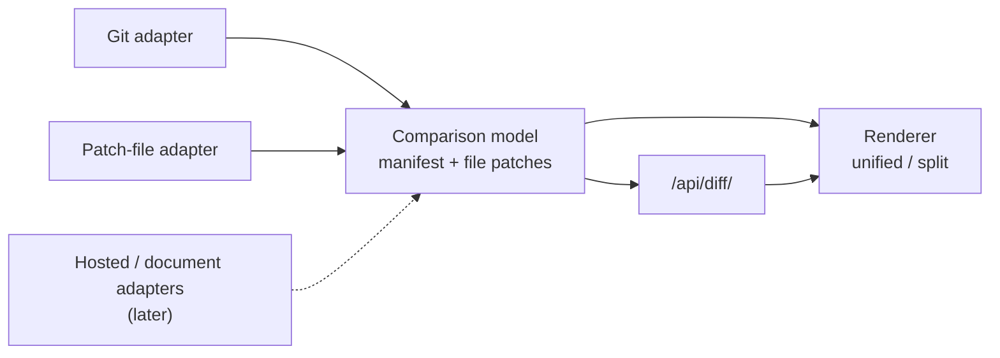

# Feature: General Diff Rendering

**Date:** 2026-08-17

**Author:** Metabrowser maintainers

**Status:** Draft

## Overview

Metabrowser can show a repository’s history but not what any commit changed.
The obvious fix is to add a diff view to the Git panel.
This plan does the opposite: it builds diff as a first-class capability of its own, with
a source-agnostic comparison model and one renderer, and makes Git the first consumer
rather than the owner.

The reason is that a diff is not a Git concept.
A comparison between two versions of a file arrives from a repository, from a hosted
API, from a `.patch` file sitting in a directory, and from a document’s own edit
history. A renderer that lives inside `git/` would have to be extracted before any of
those could use it, and extraction after the fact is where coupling gets discovered.

The design work is largely done.
[Web Diff Viewer Architecture and Intermediate Representations](../../research/research-2026-07-17-web-diff-viewer-architecture.md)
surveyed comparison semantics, intermediate representations, backends, renderers, and
competing products, and its conclusions are adopted here rather than restated.
This plan is the implementation shape those conclusions imply once diff is core rather
than a plugin.

## Goals

- Model a comparison between two snapshots, independent of what produced them
- Ship one renderer that any source can drive, with unified and split presentations
- Open a `.diff` or `.patch` file and render it like any other file kind
- Show what a commit changed, per file and whole-commit, from the Git history surface
- Return a small manifest first and fetch file bodies lazily, so a large comparison is
  navigable before it is complete
- Make partiality explicit: deferred, collapsed, binary, too large, timed out, stale,
  and unsupported are distinct visible states, never an empty body
- Decide the renderer implementation on measured evidence, including whether a runtime
  npm dependency earns its place

## Non-Goals

- Mutation. Staging, unstaging, discarding, and committing are out of scope; the read
  model has to be proven first.
- Review state. Comments, viewed-progress, and approval belong to a later slice.
- Jujutsu and hosted-provider adapters.
  The port is designed so they fit; neither is built here.
- A general editing surface.
  Applying or authoring a patch is a different feature with a different trust model.
- Replacing the Git graph.
  The history surface is the first consumer of this work, not a thing this plan
  rewrites.

## Background

### Why this is core, and why that is not the usual answer

The stated boundary keeps Metabrowser core consumer-agnostic and pushes domain schemas,
routes, renderers, and styles into plugins.
The diff research followed that boundary and concluded the work should ship as an
installed `metabrowser-diff` plugin.
That conclusion is worth revisiting, because it is what generated the platform
prerequisites this plan can now mostly skip.

A comparison model is not a consumer domain.
It is a rendering primitive, in the same sense that the file-kind registry and the
Markdown mount are primitives: several unrelated features need the same one, and each
would otherwise grow its own.
The [Git graph plan](plan-2026-08-06-git-graph-view.md) made the same argument for Git
itself — core already depends on Git for ignore semantics, so a history reader extends a
dependency core has rather than importing a new domain.

The distinction this plan draws is between the *comparison model and renderer*, which
are core, and the *sources*, which are adapters.
A Git adapter belongs beside the existing `git/` package.
A GitHub adapter, when it exists, is a plugin, because a hosted provider genuinely is a
consumer domain. The renderer does not know the difference.

### What the plugin framing was carrying

The research listed six platform gaps that had to close before a diff *plugin* could be
written: plugin sub-router mounting, an SDK data plane with POST and streaming, plugin
access to the change-event bus, a repository-scoped UI mount point, a bounded subprocess
runner, and a plugin cache helper.

Four of those exist only because the code was going to live outside core:

| Gap | Status once diff is core |
| --- | --- |
| Plugin sub-router with path params | Not needed; core mounts its own route collection, as `/api/git/` already does |
| SDK data plane (POST, NDJSON, SSE) | Not needed; core code calls core services directly |
| Plugin access to the change-event bus | Not needed; the watcher and projection events are core-internal already |
| Repository-scoped UI mount point | Already built — `registerNavPanel` landed with the Git graph |
| Bounded async subprocess runner | Already built — `git/process.py` has timeout, output caps, and a sanitized environment |
| Plugin cache helper | Not needed; core has its own mtime-keyed cache |

This is the main practical consequence of the core decision, and it is large: the work
ahead is the diff model, the renderer, and the adapters, not a platform project first.

The platform items keep their value for *external* plugins, and a GitHub adapter would
need several of them.
They stop being blockers for this plan.

### What already exists

- The research document, with an adopted layered IR and a tooling comparison.
- `git/process.py`, `git/log.py`, `git/detail.py`, and `/api/git/` on the unmerged Git
  graph branch. `git/detail.py` already returns per-file change records with status,
  additions, deletions, binary flags, and rename similarity — Layer 3 for one source,
  under a different name.
- `registerNavPanel`, the shell seam the Changes surface mounts through.
- A bead tree under `mb-ypme` that assumed the plugin framing and needs refiling.

### What we did not borrow from VS Code

`git_graph.js` derives from `scmHistory.ts` — the swimlane layout, and nothing else.
No diff code came from VS Code, and none should: VS Code’s diff viewer is Monaco, whose
one-file editor model and runtime footprint the research assessed as a poor fit unless
full IDE behavior becomes the goal.
The port is a layout algorithm, not a viewer.

## Design

### Approach

Three layers, with narrow ports between them.



A **source adapter** answers one question: given an intent, produce a resolved
comparison and a change-set manifest, and produce one file’s patch on demand.
The **comparison model** is what every adapter produces and the renderer consumes.
The **renderer** takes a file patch and paints it, and knows nothing about where it came
from.

Two properties matter more than the layering itself:

**A manifest first, bodies later.** The first response lists every changed file with its
classification, sizes, and availability, and nothing else.
File patches are fetched for what the reader opens.
A single large patch downloaded and parsed up front is the failure mode this avoids, and
lazy DOM mounting alone does not avoid it.

**Partiality is a value, not an absence.** Every file record carries an availability
state. An empty body never has to be interpreted.

### Components

| Component | Location | Responsibility |
| --- | --- | --- |
| `diff/model.py` | core | Comparison intent, resolved comparison, manifest, file patch, availability states |
| `diff/service.py` | core | Adapter registry, comparison resolution, bounded caches, cancellation |
| `diff/adapters/git.py` | core | Git source, built on the existing `git/process.py` runner |
| `diff/adapters/patch_file.py` | core | Unified-patch parser for `.diff` and `.patch` files |
| `diff/routes.py` | core | `/api/diff/` collection |
| `static/diff_view.js` | core | Renderer: unified and split, hunk expansion, states |
| `static/diff_model.js` | core | Browser-side patch model shared by every consumer |

The renderer is a core static module rather than a plugin, for the same reason the
Markdown mount is: more than one surface mounts it, and each should not carry its own.

### Module and function map

Signatures follow the conventions the Git package already established: `run_git` for
every subprocess, a `GitError` hierarchy for failure, TypedDicts plus `validate_*`
functions for the browser contract, and Pydantic `BaseModel` with
`ConfigDict(extra="forbid")` for validated documents.

**`diff/format.py`** — the Pydantic implementation of the checked-in schema.
Enums `ChangeKind`, `EntryType`, `FileMode`, `Availability`, `Side`. Models
`ContentRef`, `IntralineSpan`, `LineRecord`, `Hunk`, `FilePatch`, `FileChange`,
`ChangeSetManifest`, `ResolvedComparison`, `ComparisonIntent`. `FileChange` is a
discriminated union on `kind`, so a rename carries `old_path` and a similarity score by
construction and a type change carries both entry types.
`load_schema()` reads the checked-in JSON Schema; `validate_document(doc)` is the entry
point the conformance corpus drives from the Python side.

**`diff/apply.py`** — the correctness oracle.
`apply_change_set(manifest, patches, base, resolve_content) -> TreeSnapshot` and
`apply_file_change(change, patch, base_entry, resolve_content) -> TreeEntry`.
`resolve_content` is the injected reader that makes content references work without
embedding bytes. `TreeSnapshot.tree_hash()` produces the value the oracle compares.
Raises `NotFullyHydrated` when a change lacks what applying it requires, which is what
turns the availability states into a checked claim.

**`diff/adapters/base.py`** — the port every source implements.
`class DiffSource(Protocol)` with `resolve(intent) -> ResolvedComparison`,
`manifest(resolved) -> ChangeSetManifest`, `file_patch(resolved, file_id) -> FilePatch`,
and `content(resolved, file_id, side) -> AsyncIterator[bytes]`. Four methods, no
source-specific vocabulary.

**`diff/adapters/patch_file.py`** — the no-repository source.
`parse_unified_patch(data: bytes) -> tuple[ChangeSetManifest, dict[str, FilePatch]]`,
with `_split_file_sections`, `_parse_extended_headers` (rename, copy, mode, similarity,
binary, dissimilarity), `_parse_hunk_header`, and `_parse_hunk_body`. Bounded by byte
cap and section count; malformed input produces an `unsupported` availability rather
than an exception.

**`diff/adapters/git.py`** — the worktree-tied source.
`class GitDiffSource(DiffSource)` over `run_git`. `resolve` runs `rev-parse` and, for
pull requests and branches, `merge-base`. `_raw_changes` parses
`git diff --raw -z -M -C` into `FileChange` records — the `-z` NUL framing and the
newline-before-first-record quirk the history surface already documents apply here too.
`_numstat` fills additions and deletions when cheap.
`file_patch` runs a path-limited `git diff` and reuses the same parser as the patch-file
source, which is the point of having one format.
Merges pass `--diff-merges=first-parent`, matching the history surface.

**`diff/service.py`** — resolution, identity, and bounds.
`ComparisonService` with `register_adapter(name, source)`, `create(intent)`,
`manifest(comparison_id)`, `file_patch(comparison_id, file_id)`, and
`content(comparison_id, file_id, side)`. `comparison_id_for(resolved) -> str` derives
the self-describing identifier, so any `GET` can rebuild an evicted comparison.
Bounded LRUs for manifests and patches; `generation_token(resolved)` backs the `stale`
check for volatile comparisons.

**`diff/wire.py`** — the browser contract, mirroring `git/wire.py`. TypedDicts for every
emitted shape and `validate_manifest`, `validate_file_patch`,
`validate_resolved_comparison`, invoked from tests on everything the routes can emit.

**`diff/routes.py`** — `DIFF_ROUTES`, registered the way `GIT_ROUTES` is.

**`repo_cache.py`** — one acquisition workflow.
`ensure_repo(source) -> CacheEntry` accepting a URL or a local path;
`reference_clone(local_path)` borrows an on-disk repository without network;
`fetch_refs(entry, refspecs)` covers pull refs and arbitrary revisions;
`transient_worktree(entry, revision)` materializes a detached worktree inside the cache
and is a context manager so it is purged on exit.
Cloning and fetching live here rather than in `git/`, which keeps that package’s
read-only contract intact.

**`static/diff_model.js`** — the browser model.
`parseManifest`, `parseFilePatch`, `fileChangeLabel(change)` for the indicator set, and
`validateDocument` — the same corpus, the other side.

**`static/diff_view.js`** — the renderer.
`mountDiffView(container, patch, options) -> { dispose }`, with `renderHunk`,
`renderLine`, `expandContext(hunk, direction)`, and `renderAvailability(state)` so every
non-content state has one rendering path.
Disposal releases observers and any workers, as every mounted view must.

### The comparison model

The research’s layers are adopted with one adjustment: adapters own intent and
resolution, and the shared model begins at the manifest.

- **Intent** (`ComparisonIntent`) is adapter-specific and not a cache key.
  Git intents carry revisions and staging selectors; a patch-file intent carries a path.
- **Resolved comparison** freezes identity: schema version, source name, resolved
  endpoints, options, a deterministic comparison ID, and capability warnings.
  The ID is self-describing, so any `GET` can rebuild an evicted comparison rather than
  fail, and creation is idempotent.
- **Manifest** carries totals, ordering, partiality, and one `FileChange` per path, with
  identity, classification, VCS state, size and cost, availability, and presentation
  hints. Totals declare whether they are exact or estimated; exact line counts can cost
  as much as the patches themselves and must not block the manifest.
- **File patch** carries hunks, line records, and the intraline spans when computed.
- **Enrichments** — syntax tokens, intraline refinement — are recomputable and cached
  separately, so a theme change cannot invalidate a comparison.

Byte identities and display projections stay separate throughout: paths and blob
contents are bytes, and the JSON projection is Unicode.

### Sources

Four are named. Two are built here; the other two exist to keep the port honest, because
an abstraction with one implementation is a guess.

1. **Patch file** — opening a `.diff` or `.patch` renders it.
   Needs no repository, no subprocess, and no network, which makes it the cheapest
   possible proof that the model and renderer work without Git.
   It is also independently useful.
2. **Git** — a commit against its parent, and the uncommitted states.
   Built on `git/process.py`, whose bounds and environment sanitizing already exist.
3. **Hosted provider** (later, plugin) — GitHub compare and pull-request versions.
4. **Document edits** (later) — a saved edit or annotation set rendered as a comparison
   against the prior version.

### Consumers and composition

Four surfaces consume comparisons, and none of them is a feature silo.
Each is a composition of layers that exist or are already planned:

| Layer | Provides | Where |
| --- | --- | --- |
| Acquisition | A local tree: a path today, a Git URL into the purgeable repo cache | [Open a repo from a Git URL](plan-2026-08-11-open-repo-from-git-url.md) |
| History | The commit graph over any local repository | [Git graph](plan-2026-08-06-git-graph-view.md) |
| Comparison | Manifest, file patches, renderer | This plan |
| Annotation | Anchored threads and marks over a comparison | Deferred; anchor model reserved below |

The composition that proves the layering is **viewing a pull request**, because it
exercises every layer and adds almost nothing of its own.
GitHub exposes each pull request over plain git transport as `refs/pull/<n>/head` and
`refs/pull/<n>/merge` — verified live, with no API and no token.
The `merge` ref is the provider-computed synthetic merge result the research said a
hosted comparison must record.

Opening a PR URL therefore decomposes as: derive the repository URL and clone or reuse
the cache (acquisition); fetch the two pull refs (one bounded `git fetch`, beside the
existing clone path); resolve a merge-base comparison between the base branch and the PR
head (the same three-dot semantics GitHub itself uses, already required for branch
comparisons); render it (this plan’s renderer).
The diff bodies never touch the GitHub API. Only two things do, and both are small and
deferrable: PR metadata (title, state, checks) for the header, and review threads for
the annotation layer.
That is the true hosted-provider surface, and it is a conversation plane, not a diff
plane — which sharpens the core/plugin split above: PR *refs* ride the git transport and
belong to the core Git adapter; PR *conversation* is provider API territory and belongs
to a plugin.

A documentation-heavy PR also shows where Metabrowser can be better than the hosting
site rather than merely equal: the manifest’s rich-view hint plus content-at-revision
means a changed Markdown file can be read rendered at the head revision, not only as
patch text. A hosted site shows the diff of a document; this shows the document.

The annotation layer is deliberately not built here, but the comparison model reserves
its anchor shape — comparison and file-change IDs, side, immutable content identity,
byte and line range, and a context fingerprint — because line numbers alone do not
survive a moving pull request or an edited file.
GitHub review threads are the first intended consumer, read-only; a document’s own saved
edits and annotations are the second, and both arrive as data over the same anchors
rather than as new renderer features.

### One acquisition workflow

Acquisition is one instance of the container materialization rule in
[nav containers](../../architecture/arch-nav-containers.md): bounded transient cache
directories that the ordinary serving path routes into, shared as one mechanism by PR
fetches, patch anchoring, and future archive unpacking.

Three flows must feel like slight variations of one workflow, because they are: browsing
a transient checkout of a repository URL, viewing a transient pull request, and viewing
a pull request against a repository already on disk.
They differ only in where objects come from and which refs are fetched:

1. **Object store.** A remote URL clones into the purgeable cache; a repository already
   on disk is borrowed into the cache with a reference clone, which is near-instant and
   needs no network; a cache hit reuses either.
2. **Refs.** The default branch for browsing; `refs/pull/<n>/head` and `/merge` for a
   pull request; arbitrary revisions for a two-ref comparison.
3. **Materialization.** When a filesystem tree is needed — the serve path expects one —
   a transient detached worktree is created inside the cache and purged with it.

The user’s own repository is never fetched into, checked out, or otherwise written —
transient materialization always happens in the cache, which preserves the git package’s
read-only contract while making the local-repository case simply the fastest variant of
the same flow. After acquisition, every flow converges: the same serve path, the same
tree, the same comparison context.

### The shell is the review surface

Reviewing a change set does not get a new surface.
The existing shell maps onto it with three customizations, each extending a mechanism
that already exists rather than adding one:

0. **A comparison is a container in the tree.** The durable ontology is in
   [nav containers](../../architecture/arch-nav-containers.md): every tree entry is
   item-like (opens views), folder-like (expands to children; selecting the entry itself
   opens an overview), or both, and directories are the already-working precedent rather
   than a special case.
   A patch file or PR mirror is a folder-like entry whose children are its file changes;
   selecting the container opens the change-set summary, and selecting a child opens
   that file’s diff tabs.
   The two customizations below are the container contract applied to comparisons, and
   the same contract later carries archives and zoomed (re-rooted) views.
1. **The comparison scopes the tree, the way a filter already does.** The Files panel
   already swaps its data source — a recency window renders `/api/recent` through the
   same tree renderer — and the filter bar already narrows what the tree shows.
   A comparison composes both moves: the manifest is a third source, and its scope *is*
   a filter down to the files that changed.
   Rows carry the same change indicators the hosting sites use, driven by the complete
   classification below: added, deleted, modified, renamed with the old path visible
   (including a move to another folder), copied, mode change, type change such as file
   to symlink, binary, and unsupported.
   Selection routes through the same `navigateToPath` and preferred-view path every
   other selection uses.
2. **Presentations are view tabs on the file.** The file envelope already carries
   ordered view descriptors, the shell mounts them lazily as tabs, and `preferredViewId`
   picks one. In comparison context a changed file’s descriptor list gains comparison
   views, and **Diff** becomes the context default.
   Every later presentation — Before, After, rendered-at-revision for Markdown, an
   inline diff inside the rendered document — is another tab from the same diff layout,
   not a new mechanism.
3. **The context is addressable.** A comparison scopes what the tree shows and what the
   tabs mean, so it must live in the URL like every other selection since the `/view/`
   scheme landed. That is the open URL-grammar decision, and this mapping is why it is
   structural rather than cosmetic.

Live updates freeze differently here: a historical comparison is immutable, and an
uncommitted one goes `stale` with a refresh offer rather than repainting under the
reader — the rule the comparison model already states.

View phasing for a changed text file, all tabs from one diff layout:

| Phase | Tabs |
| --- | --- |
| First | **Diff** (unified source), After |
| Next | Before; **Rendered** at the head revision for Markdown |
| Later | Split and inline presentations; the diff shown inside the rendered document |

### The format is defined standalone, up front

The change model is the part of this design with the most corner cases — renames that
are also edits, copies, mode flips, type changes between file and symlink and submodule,
unmerged paths, binary transitions, missing trailing newlines, non-UTF-8 paths — and
discovering them incrementally means backfilling the model over and over, invalidating
consumers each time.

So the model ships the way File Rollup Format did: a standalone architecture document
under `docs/project/architecture/file-diff-format/`, with JSON schemas and a generated
conformance corpus in `data/` that runs against both the Python and browser
implementations, so a change record cannot quietly mean different things on the two
sides. The document enumerates the complete taxonomy once, before the first consumer.

**Git’s model is the reference semantics whenever there is doubt** — its statuses,
rename and copy scoring, mode and type transitions, and combined-merge behavior are the
compatibility target, and the conformance corpus encodes git-produced cases directly.
Existing diff-model and unified-patch parser libraries are evaluated against this format
before any in-house parser is written; a library that matches the model earns the
adapter, and the format — not the library — remains the contract either way.

**Schema authority and implementations.** The neutral JSON Schema is the contract,
checked in beside the format document and versioned — the third instance of the
repository’s established pattern, after the rollup schema and the tree wire model.
Neither language side owns the format, because producers and consumers will exist on
both sides. In Python, Pydantic models implement it: pydantic is already a runtime
dependency and already the idiom for validated documents (`plugin_loader/manifest.py`),
and discriminated unions on the change kind are exactly its strength.
The checked-in schema remains the authority; the conformance corpus, run through the
Pydantic models and the browser model alike, is what keeps every implementation honest.
In the browser the format is `types.d.ts` declarations plus the corpus-driven validator
— not Zod, because the corpus already provides the guarantee Zod would, and the
zero-runtime-npm-dependency posture is evaluated once, at the Phase 3 renderer gate, not
spent early on validation.

**The apply oracle.** “Fully modeled” has a testable definition: a fully hydrated change
set, applied to the base tree, must reproduce the target tree — byte for byte, verified
by tree-hash equality, with modes, symlinks, renames, and type changes included.
Apply takes a content resolver, so content may be referenced rather than embedded; the
availability states then have a precise meaning — they are the declared gaps in
applicability, not rendering annotations.
A model that applies cleanly necessarily contains everything any view needs, which is
the property that makes valid-therefore-renders-cleanly true rather than hopeful.

**Standalone and worktree-tied are layers, not alternatives.** The format is standalone:
a validated document with no requirement that a repository exists, which the patch-file
source proves in Phase 1. Producers may be worktree-tied: the Git adapter resolves refs
in a local object store and fills the same model lazily, manifest first, patches on
demand, with hydration recorded per file in the availability field.
A fully hydrated model is therefore a portable artifact — it can be exported, archived,
and applied — while a partially hydrated one remains bound to its source through content
references. Both are the same format.

### API changes

A core route collection under `/api/diff/`, following the research’s shape:

```text
POST /api/diff/comparisons                              create; returns resolved comparison + manifest
GET  /api/diff/comparisons/{comparison_id}              rebuild from a self-describing ID
GET  /api/diff/comparisons/{comparison_id}/files/{file_id}/patch
GET  /api/diff/comparisons/{comparison_id}/files/{file_id}/content/{side}
```

File IDs are opaque; raw paths never appear in URL path segments.
ETags derive from the resolved comparison, content identities, options, and producer
version. Volatile worktree content is never cached under a symbolic name alone.
HTTP cancellation terminates queued work and, where safe, the underlying process.

`/api/file` gains `diff` as a kind for `.diff` and `.patch`, so the patch-file source
reaches the reader through the existing file-preview path with no new surface.

### Bounds and failure behavior

Every bound is stated with the cost it protects, per the repository’s rule that a limit
is a claim about cost.

- Manifest file cap, with a continuation cursor for pathological repositories.
- Per-file patch byte cap; over it, the file reports `too_large` and offers raw export.
- Per-comparison wall clock; over it, undelivered files report `timed_out`.
- Subprocess timeout and output cap, inherited from `git/process.py`.
- Bounded LRU of materialized manifests and patches; eviction is invisible apart from
  latency, because any ID can be rebuilt.
- Volatile comparisons carry a generation token.
  If it moves mid-request the response is `stale` and the reader is offered a refresh
  rather than being moved while reading.

## Implementation Plan

Three phases. The first two each end at something usable; the third is the enrichment
that makes it pleasant, and carries the dependency decision.

### Phase 1: Comparison model, patch-file source, and unified renderer

Ends with: opening a `.patch` file renders a real diff.
No Git involvement.

- [ ] File Diff Format: the standalone architecture document, JSON schemas, and
  conformance corpus described above, following git semantics; evaluate existing
  diff-model libraries against it before writing any parser
- [ ] `diff/model.py`: intent, resolved comparison, manifest, file patch, availability
  states — implementing the format, with wire validators in the style of `git/wire.py`
- [ ] `diff/adapters/patch_file.py`: bounded unified-patch parser covering renames,
  copies, mode changes, binary markers, and malformed input
- [ ] `diff/service.py`: adapter registry, deterministic comparison IDs, bounded caches
- [ ] `diff/routes.py`: the `/api/diff/` collection above
- [ ] `diff` file kind wired into classification and the view registry
- [ ] `static/diff_model.js` and `static/diff_view.js`: unified rendering, hunk context
  expansion, sticky file headers, every availability state
- [ ] Golden fixtures: a corpus of patches including pathological and malformed cases

### Phase 2: Git source and the Changes surface

Ends with: selecting a commit in the Git panel shows what it changed, per file and whole
commit.

- [ ] `diff/adapters/git.py` on the existing runner: commit-versus-parent, staged,
  unstaged, all uncommitted
- [ ] Rename and copy detection with stated limits
- [ ] `--diff-merges=first-parent` for merges, matching the history surface
- [ ] Comparison context in the shell: the Files tree renders the manifest as a third
  source beside tree and recent, scoped like a filter to the changed files, with the
  full change-indicator set from the format
- [ ] Comparison views injected into changed files’ view descriptors, Diff as the
  context default, After beside it; selection flows through `navigateToPath`
- [ ] Commit detail in the Git panel links into the comparison rather than re-rendering
- [ ] Watcher-driven `stale` for uncommitted comparisons

### Phase 3: Enrichment and the renderer decision gate

Ends with: split view, intraline highlighting, syntax, and virtualization, on whichever
implementation the measurements justify.

- [ ] Benchmark harness over the representative fixtures, measuring first-paint, scroll,
  and memory at stated corpus sizes
- [ ] Evaluate `@pierre/diffs` and `@git-diff-view/core` against the Phase 1 in-house
  renderer extended in place, scoring: bundle size, worker behavior under the Content
  Security Policy, dependency count and update cadence, accessibility, design-token
  integration, and the maintenance surface each leaves behind
- [ ] Record the decision and its evidence in this document
- [ ] Split view, intraline refinement, bounded syntax highlighting, and row
  virtualization on the chosen path
- [ ] Whitespace and wrap controls, keyboard next-file and next-hunk navigation

## The dependency question

Metabrowser ships no runtime npm dependencies today and has no bundling step, so
adopting a renderer library means introducing both.
That is a real cost and this plan does not pretend otherwise.
It is also not a veto: the test is whether the dependency is more maintainable on
balance than the code it replaces.

The honest split is that the *unified* renderer is small — hunks, line records, context
expansion, and state chrome are a few hundred lines against a model we already own, and
Phase 1 builds it either way.
What libraries actually sell is the expensive half: split alignment, intraline
refinement, incremental syntax through a worker, and row virtualization that survives
sticky headers and scroll anchoring.
That is why the gate sits at Phase 3 rather than Phase 0 — by then the in-house renderer
exists, and the comparison is against a known quantity instead of an estimate.

Two constraints hold whichever way it goes.
A library never becomes the server contract: an adapter maps our file patch onto its
shape, so replacing it later is local.
And a plain renderer stays for degraded and unsupported cases, because the states in the
model have to render somewhere.

## Testing Strategy

- **Model and adapters.** Golden fixtures for the patch parser, including renames,
  copies, mode and type changes, binary markers, missing trailing newlines, CRLF,
  non-UTF-8 paths, and malformed input that must fail as `unsupported` rather than
  crash. Fixture repositories for the Git adapter, built by script so they are
  reproducible.
- **Bounds.** Each cap has a test that crosses it and asserts the reported state, not
  just the absence of a crash.
- **Format conformance.** The corpus from the format document runs against both the
  Python model and the browser model, in the way the file-rollup corpus already does, so
  the two sides cannot drift.
- **The apply oracle.** For fixture (base, target) pairs, compute the model, apply it to
  the base tree through the content resolver, and assert tree-hash equality with the
  target — the completeness proof, run over the same corpus repos as the adapter tests.
- **Wire contracts.** Runtime validators on every emitted shape, in the style
  `git/wire.py` established, with `types.d.ts` kept in the same commit.
- **Renderer.** DOM behavior tests for unified and split projections, context expansion,
  every availability state, and disposal — a mounted comparison must release workers,
  observers, and streams when replaced.
- **Integration.** Real-browser coverage for the Changes surface: selecting a commit,
  opening a file, expanding context, and switching presentations.
- **Performance.** The Phase 3 harness runs against the representative fixtures and
  records numbers in this document beside the decision they informed.

## Open Decisions

- Whether hunks are produced by the Python adapter or parsed in a browser worker from
  bounded per-file patches.
  Server production is the cleaner target.
- How a comparison is addressed in the `/view/` URL grammar so a diff is linkable.
  (Whether review needed its own surface is resolved above: it is the existing shell in
  a comparison context.)
- Whether the core file tree gains a decoration API so changed and staged files can be
  badged in place. This moves the core boundary and should be settled before the Changes
  surface ships rather than after.
- How strong local consistency must be for uncommitted comparisons: optimistic
  generation and refresh, or bounded content-addressed worktree snapshots.
- Whether additions and deletions are deferred when exact counts would delay the
  manifest.

## References

- [Web Diff Viewer Architecture and Intermediate Representations](../../research/research-2026-07-17-web-diff-viewer-architecture.md)
- [Git graph nav panel and read-only Git API](plan-2026-08-06-git-graph-view.md)
- [Rendering large content](../../../large-content-rendering.md)

<!-- This document follows common-doc-guidelines.md.
See github.com/jlevy/practical-prose and review guidelines before editing.
-->
