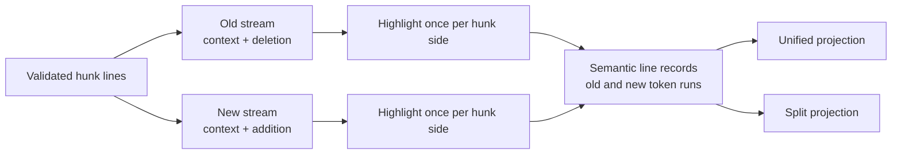

# Feature: Diff Syntax Highlighting and Layouts

**Date:** 2026-08-24

**Author:** Metabrowser maintainers

**Status:** Draft

## Overview

Metabrowser’s regular source views use Highlight.js and the shared semantic syntax
palette. The diff view renders the same source as unstyled text, so code becomes harder
to scan precisely where a reader needs to compare it.

This plan gives diffs the regular source palette without giving syntax its own
background. Added and deleted rows keep their existing status tints.
It also completes the related unified and split presentations with one semantic line
model rather than two renderers.

The central rule is simple: reconstruct the visible old and new source for each hunk,
highlight those two streams independently, and attach their token runs back to the
semantic lines. Unified and split views are projections over those lines.
The mixed patch stream is never passed to a lexer, and lines are never highlighted one
at a time.

## Goals

- Use the same languages, Highlight.js grammars, foreground colors, and size policy as
  regular source views.
- Keep add and delete backgrounds as the only syntax-background difference from a
  regular view.
- Preserve multiline lexical context within every visible hunk.
- Render unified and split layouts from one highlighted old/new line model.
- Make layout switching immediate, persistent, and independent of data fetching or
  tokenization.
- Paint readable plain text first and treat highlighting as progressive enhancement.
- Keep deferred file hydration, folding, disposal, and all availability states correct
  in both layouts.

## Non-Goals

- Full-file lexical accuracy across omitted hunk gaps.
  The current browser payload does not contain the omitted source, and inventing
  adjacency would be less correct than restarting the grammar at each hunk.
- Intraline word or character emphasis.
  The token model will leave a composition seam for it, but `mb-hhmb` continues to own
  that later refinement.
- Whitespace-ignore controls, context expansion, review comments, editing, or patch
  application.
- A new diff library, editor runtime, browser worker, or runtime dependency.
- Row virtualization. Existing bounds remain in force; later measurements can justify
  virtualization independently.
- New File Diff Format fields, routes, content endpoints, file kinds, or view IDs.

## Background

### Current implementation

The built-in text plugin emits a language class from
`window.metabrowser.langForExtension`, and the shell enhances its `<code>` element when
the prefetched Highlight.js asset is available.
Large previews use the shared `SYNTAX_HIGHLIGHT_MAX_BYTES` policy and remain plain text.
The host stylesheet owns the semantic `.hljs-*` foreground palette and verifies its
contrast in both themes.

The built-in diff plugin already renders validated File Diff Format documents, fetches
deferred file patches, folds large changed runs, and disposes its mounted root.
Its hunk renderer sends every line through `textContent`, applies an add or delete row
tint, and does no language resolution or tokenization.

That leaves a narrow implementation gap.
The server model already distinguishes old and new sides and every hunk line already
carries `context`, `add`, or `del`. Syntax and layout can remain browser-only
projections.

### Product review

The review focused on current, primary implementations rather than screenshots or
secondhand descriptions.

| Viewer | Relevant behavior | Decision for Metabrowser |
| --- | --- | --- |
| GitHub pull requests | Unified and split are preferences. Standard syntax foregrounds sit on transparent token spans while add and delete cells supply the background. Split rows pair old and new cells and pad an absent side. GitHub puts the choice in Diff settings and applies it with a reload. | Mirror the visual layering and row pairing. Make the choice lighter: a visible two-option control switches locally without reload. |
| React Diff View | Tokenization can use full old source and reconstruct new source for better multiline accuracy. It documents that patch-only input can misclassify constructs spanning omitted context. Its split projection pairs nearby deletion and addition sequences. | Reconstruct both sides, but reset at honest hunk boundaries until full source is available. Pair each contiguous changed run by position. |
| CodeMirror MergeView and Monaco Diff Editor | Both compare complete old and new documents and offer side-by-side and inline presentations. Their editor models solve selection, editing, alignment, and full-document state. | Keep them out of this read-only renderer. Their full-document model explains the accuracy ceiling but their runtime and editing surface do not earn a place here. |
| Git `diff-highlight` | Intraline emphasis pairs equal-sized removed and added groups, then finds common edges rather than attempting semantic parsing. | Keep syntax tokenization separate from a future intraline overlay, and reserve stable text offsets for that overlay. |
| `@pierre/diffs` and `@git-diff-view/core` | Both offer richer diff-rendering machinery, but adopting either would introduce a runtime dependency and bundling to a repository that currently ships neither. Their main advantage is in intraline refinement, virtualization, and worker tokenization. | Keep the owned renderer for syntax and positional split alignment. Leave the dependency gate open for the deferred features that could justify its cost. |
| Server-side tokenization | A Pygments-style service could return highlighted source with each diff payload. | Reject it because it would add a second grammar registry and palette, change the wire format, and diverge from the client-side Highlight.js path used by regular source views. |

The live GitHub review also showed progressive enhancement: split cells were readable as
plain text first and received syntax spans shortly afterward.
That is the right failure mode for Metabrowser too.

## Design

### One model, two projections

Each validated hunk becomes an internal array of line records with stable source text,
operation, old and new line numbers, and optional token-run arrays for both sides.
Each run contains text and the active Highlight.js classes at that text offset; it is
plain data, not a DOM node or HTML fragment.
Context records can carry two token-run arrays because the same text may have different
lexical state in the old and new documents.



The projections choose tokens as follows:

| Line operation | Unified | Split left | Split right |
| --- | --- | --- | --- |
| Context | New-side tokens | Old-side tokens | New-side tokens |
| Deletion | Old-side tokens | Old-side tokens | Empty |
| Addition | New-side tokens | Empty | New-side tokens |

Unified context uses the after-document interpretation because it is the one source
state that remains after the patch.
Split preserves both interpretations.

### Syntax pipeline

For each ready textual file:

1. Resolve the old language from the old path and the new language from the new path
   through the existing extension-to-language mapping.
   This handles a rename that also changes extensions without adding language fields to
   the wire format.
2. Before doing any highlighting, total the UTF-8 bytes that would be sent to the lexer
   across both visible sides, including duplicated context.
   If the file crosses the existing syntax-highlight limit, leave the whole file plain.
   Do not produce a half-highlighted diff.
3. For each hunk, join `context + del` lines into the old stream and `context + add`
   lines into the new stream.
   Keep an index from stream line back to the semantic line record.
4. Highlight each nonempty side as one continuous source string through the shared
   syntax service. Never highlight the interleaved unified patch, because deletion text
   can corrupt the new lexical state and addition text can corrupt the old one.
   Never invoke the lexer per line, because that breaks multiline strings and comments
   and multiplies call overhead.
5. In the syntax service, scan Highlight.js’s constrained output vocabulary into
   per-line token runs.
   The scanner recognizes only opening token spans, closing spans, text, and the five
   entities emitted by the vendored version: `&amp;`, `&lt;`, `&gt;`, `&quot;`, and
   `&#x27;`. It rejects every other tag, attribute, class shape, or entity, carries the
   active class stack across newlines, and decodes entities into run text; it never
   assigns the highlighter output to `innerHTML` or asks a DOM parser to interpret it.
6. Assert that the token-line count matches the source-line index and that concatenating
   each line’s run text exactly reproduces its source line.
   If either check fails, retain plain-text records and report one diagnostic.
7. Attach the token-run arrays to the semantic line records.
   Each projection creates token spans with `createElement`, assigns only
   scanner-validated Highlight.js classes, and assigns content through `textContent`.

A hunk is the largest honest lexical unit currently available.
Two hunks have omitted text between them, so carrying grammar state across that gap
would imply source that the client never received.
Whole-file content hydration can improve this later without changing the line model or
either layout projection.

### Host syntax service

The diff plugin must not reach through `window.metabrowser` to a private shell function
or depend directly on a third-party global.
Add one narrow, additive SDK helper and data shape:

```typescript
interface MetabrowserSyntaxTokenRun {
  classes: string[];
  text: string;
}

type MetabrowserSyntaxTokenLines = MetabrowserSyntaxTokenRun[][];

highlightSyntax(
  source: string,
  language: string,
  options?: { signal?: AbortSignal },
): Promise<MetabrowserSyntaxTokenLines | null>;
```

The helper waits for the existing prefetched syntax assets, checks that the requested
grammar exists, enforces the shared syntax size bound, calls
`hljs.highlight(source, { language, ignoreIllegals: true })`, and returns DOM-free token
lines. It resolves to `null` for an unknown language, an unavailable asset, or an
over-limit input, and treats a lexer or scanner exception as the same plain-text
fallback. It rejects with `AbortError` when the supplied signal aborts.
Asset failure cannot leave the promise pending: the optional chain fires
`metabrowser:optional-assets-loaded` after both success and failure, which settles every
waiter.

This keeps asset readiness, the global Highlight.js call, input escaping, and the bound
inside the host. The existing regular-view enhancer can continue to highlight mounted
`<code>` elements; both paths share the same library, grammar registry, loading tier,
and palette. No asset moves into the eager shell and no package or lockfile changes.

The service reads `METABROWSER_SETTINGS.SYNTAX_HIGHLIGHT_MAX_BYTES`, which carries the
server’s environment-aware value, and uses the package constant only when no injected
setting exists. Update `isLargeTextPreview` to read the same value rather than retaining
its hard-coded mirror.
The service needs `highlight`, `getLanguage`, and `highlightElement` in the ambient
Highlight.js declaration.
The public SDK declaration and source change together.

### Unified layout

Unified remains the default and retains the existing row order, line-number columns,
markers, folding, sticky file bars, and availability copy.
The only structural change inside a text cell is a token host whose background is
explicitly transparent.
Rendering token data uses newly created spans and `textContent`; no shipping diff path
parses or retains highlighted HTML.

The initial render always uses `textContent`. When token runs arrive, the renderer
replaces text cells only if the mount is still current.
Highlighting failure leaves the plain rows untouched.

### Split layout

Split is a second projection of the same semantic records, not a second parser or
tokenizer.

- Duplicate context on the left and right, using each side’s line number and tokens.
- For every contiguous changed run, collect deletions and additions independently, pair
  them by position, and pad the shorter side with an empty cell.
- Preserve source order within each side.
  Do not run a similarity algorithm merely to rearrange lines.
- Keep no-newline indicators attached to their source side.
- Keep the hunk header and fold control full-width across both sides.
- Give each code side a practical minimum width and let the diff body scroll
  horizontally when the container cannot support both.
  Do not silently change the user’s selected layout at a breakpoint.
- Allow selection from only one code side at a time.
  Pointer-down in an old or new text column marks that side as active and suppresses
  `user-select` on the opposite side until pointer-up or cancellation.
  Full-width hunk headers and fold controls clear the side gate and never become part of
  either code-column selection.
- Count fold thresholds and labels in paired rows.
  For a changed run with `D` deletions and `A` additions, split length is `max(D, A)`;
  one fold boundary hides the same paired row interval on both sides.
  Expanded state is keyed by file, hunk, and changed-run index so it survives
  reprojection even when unified and split projected lengths differ.

The positional pairing matches GitHub’s predictable presentation and leaves semantic
intraline pairing to its own later feature.

### Layout control and preference

Add a compact joined `Unified / Split` chip group to an always-present diff toolbar,
using `mb.filterControls.groupHtml` and `bind` with `data-select="one"` and
`data-layout="joined"`, the design system’s existing exclusive-control primitive.
Multi-file totals share that toolbar; a single-file diff shows only the control rather
than repeating its file name and counts.

The preference key is `diff.layout`. Read it through `mb.prefs`, accept only `unified`
or `split`, and default to `unified`. A click writes the preference and reprojects the
already loaded model immediately.
It must not reload the page, refetch a manifest or patch, restart deferred hydration, or
rerun Highlight.js. The cookie-backed preference then applies across local Metabrowser
instances.

Reprojection preserves collapsed file sections, expanded changed-line folds, hydrated
patches, and pending fetches.
Keeping both complete layouts hidden in the DOM is explicitly rejected because it
doubles the row and token-node cost.

### Color and contrast

The row remains the only background owner:

- context uses the ordinary diff surface;
- addition uses the existing light `--status-success` mix;
- deletion uses the existing light `--status-error` mix; and
- the `.hljs` token host uses `background: transparent` and no padding or block layout.

All token foregrounds come from the host `.hljs-*` palette.
No plugin-local syntax colors and no copied Highlight.js theme are added.
Extend the syntax palette test to compose every semantic token color over the actual
addition and deletion backgrounds in light and dark themes and require the existing
4.5:1 text contrast threshold.

### Loading, lifecycle, and cost

Highlighting is enhancement, so first paint, unknown languages, asset failure, and the
large-file path are all readable plain text.
The renderer performs at most two lexer calls per visible hunk and stores their
projected token runs for both layouts.
Switching layouts is DOM work only.

Enhance one file at a time in document order and yield to the event loop between files.
Hunks within one file stay together under the per-file input bound, while a comparison
with many near-limit files cannot become one unbounded synchronous enhancement pass.
Keep the aggregate-cap question in the measurement phase rather than guessing a second
limit.

Speed is not the product constraint that should complicate this slice.
The simple main-thread implementation is preferred over a worker protocol.
The existing measured syntax bound still protects responsiveness, and the actual
lexer-input total—not patch file size or line count—is the quantity checked.
If later fixtures show a problem below that bound, record the browser measurement beside
any new limit or worker decision as required by
[Rendering large content](../../../large-content-rendering.md).

Give the mount one `AbortController` and a disposed generation guard.
Disposal aborts pending syntax waits and deferred file fetches where the loader accepts
a signal; late results may update neither cached view state nor detached DOM. A layout
change increments only the projection generation, not the data or token generation.

## Components and Interfaces

| Surface | Planned change |
| --- | --- |
| `static/plugin-sdk.js` | Add the bounded, abortable syntax-token helper and DOM-free Highlight.js output scanner over the existing prefetched asset; unify the injected size-bound lookup. |
| `static/types.d.ts` | Declare the SDK helper, token-run data, and the Highlight.js methods it uses. |
| `builtin_plugins/diff/diff-syntax.js` | Build old/new hunk streams, validate token-line round trips, and attach side-specific token data. New fully strict module. |
| `builtin_plugins/diff/diff-view.js` | Introduce stable line records, unified and split projections, the toolbar preference control, cached deferred patches, and disposal guards. |
| `builtin_plugins/diff/index.js` | Pass the mount abort signal through deferred comparison fetches so replacement cancels both data and syntax work. |
| `builtin_plugins/diff/styles.css` | Add split geometry, toolbar placement, transparent syntax hosts, and horizontal overflow using design tokens and shared controls. |
| DOM behavior suites | Cover projection, preference, async enhancement, folding, hydration, switching, and disposal. |
| Syntax palette tests | Verify the existing foreground palette over the actual diff backgrounds in both themes. |
| Asset and SDK contract tests | Keep syntax prefetched rather than eager, and keep helper source and declarations synchronized. |
| `CHANGELOG.md` | Record the additive syntax-token SDK helper and visible unified/split diff control. |

No registered kind, view, route, format, or plugin hook changes, so the architecture
views/models/routes map does not change.

## Compatibility

- The new SDK helper is additive.
  The server, shell, and built-in plugin ship together, so it needs no compatibility
  shim and does not break the plugin SDK gate.
- File Diff Format documents and API responses are unchanged.
  Language is derived in the browser from each side’s existing path.
- `diff.layout` is new display state with an explicit validated default.
  An absent, malformed, or future value falls back to unified; no migration is needed.
- Existing links remain unified for a first-time reader.
  Layout is a display preference, not URL state, so it does not change resource identity
  or navigation history.
- Plain-text rendering remains the fallback contract for every current document and
  availability state.

## Implementation Plan

### Phase 1: Shared syntax service and highlighted unified view

Ends with: the existing unified diff progressively receives the regular source palette
while retaining its row backgrounds.

- [x] Add the typed, bounded `mb.highlightSyntax` SDK helper and DOM-free scanner, with
  focused behavior tests for ready, delayed, missing, unknown-language, over-limit,
  lexer-throw, malformed-output, and aborted cases.
  Pin the vendored entity vocabulary with a test.
- [ ] Add the strict diff syntax module with old/new reconstruction, multiline token
  data, exact text round-trip checks, and old-path/new-path language resolution.
- [ ] Refactor hunk rendering around stable line records and enhance unified cells from
  their side-specific token runs.
- [ ] Add transparent token-host styling and extend contrast tests to the add/delete
  composites in both themes.
- [ ] Cover added, deleted, modified, renamed-across-language, unknown-language,
  no-trailing-newline, truncated, and over-limit files.
  Include a known-degraded hunk that begins inside a multiline construct and prove the
  error is cosmetic and contained to that hunk.
- [ ] Assert that the shell’s global `pre code:not(.hljs)` enhancer cannot select diff
  token hosts and double-highlight them.

### Phase 2: Split projection and effortless switching

Ends with: one visible control switches the loaded comparison between unified and split
without network or lexer work.

- [ ] Add the split alignment projection: duplicated context, positional changed-run
  pairing, empty padding, and side-specific numbers and token runs.
- [ ] Add the always-present toolbar and joined layout control, backed by the validated
  `diff.layout` preference.
- [ ] Preserve section, fold, hydration, and token state across projection changes; keep
  only the active projection mounted.
- [ ] Add split geometry, full-width hunk/fold rows, practical code-column minimums,
  horizontal overflow, one-side selection semantics, keyboard semantics, and
  reduced-motion behavior.
- [ ] Cover unequal add/delete runs, pure additions and deletions, different old/new
  languages, narrow containers, repeated switches, preference restoration, an
  unequal-run fold, and multi-row copy from one split side.

### Phase 3: Browser validation and documentation reconciliation

Ends with: the feature has passed the repository handoff gate and the parent diff plan
points to this resolved Phase 3 design.

- [ ] Add a real-browser fixture that observes plain-first rendering, later token
  enhancement, immediate layout switching, and no duplicate fetch or highlighting work.
- [ ] Exercise deferred hydration and disposal while syntax and patch requests are in
  flight.
- [ ] Record representative lexer input, call count, and main-thread duration with the
  existing performance instrumentation, including a comparison with many ready files
  near the per-file bound.
  Change no bound unless the measurement supports it.
- [ ] Update the dated addendum in the general diff-rendering plan with the
  implementation outcome and measurements; leave intraline, context, whitespace, and
  virtualization in their existing follow-up bead.
- [ ] Update `CHANGELOG.md` for the additive SDK helper and the visible unified/split
  diff control.
- [ ] Run `make format` and `make verify`.

## Testing Strategy

- **Pure token projection.** Load the vendored Highlight.js build in the existing
  jsdom-free Node harness.
  Assert DOM-free token data, exact visible text, and token classes for multiline
  comments, template strings, escaped `<script>` text, every supported emitted entity,
  blank lines, trailing newlines, and grammars whose spans cross line boundaries.
- **Side correctness.** Use edits that deliberately change lexical state.
  Assert that deletions use old tokens, additions use new tokens, unified context uses
  new tokens, and split context uses its respective side.
- **Layout.** Golden DOM-shape assertions cover unified order and split pairing without
  snapshotting incidental generated IDs.
  Empty padding must not invent line numbers, markers, copyable text, or no-newline
  state. Unequal-run folding counts paired rows.
  DOM behavior tests assert the pointer side gate, and a real-browser selection test
  copies only the active split side across multiple rows.
- **Progressive enhancement.** Mount without Highlight.js, assert complete plain text,
  make the asset ready, and assert in-place token enhancement with no data reload.
  A failed asset chain settles to plain text, and a many-file fixture yields between
  file units rather than running one synchronous pass.
- **Bounds.** Cross the shared limit with the combined lexer input and assert that both
  sides stay plain. A file just below the limit highlights in both layouts without a
  second lexer pass after switching.
- **Lifecycle.** Toggle during deferred hydration, collapse before tokens arrive, and
  dispose before both operations complete.
  No late mutation, unhandled rejection, detached-node work, or repeated fetch is
  allowed.
- **Accessibility.** The layout group has one accessible label and exclusive state;
  keyboard activation updates `aria-pressed` or radio semantics.
  Source order remains intelligible, empty split cells stay hidden from assistive text,
  and horizontal scrolling does not trap focus.
- **Visual contract.** Test semantic token contrast against context, addition, and
  deletion surfaces in both themes.
  Real-browser checks cover long lines, narrow panes, sticky file bars, fold controls,
  one-side split selection, and absence of token-level backgrounds.

## Rollout

Ship unified highlighting first if Phase 1 and Phase 2 do not land together; it is a
complete enhancement and preserves the existing default.
Split remains unavailable until its projection and control are both present.
No feature flag, data migration, or server rollout order is required.

Unknown languages, unavailable assets, and over-limit documents continue to render plain
text. Those are normal degraded states, not rollout blockers.

## Open Questions

None for this slice.
Full-source hydration, intraline emphasis, whitespace handling, context expansion, and
virtualization remain explicit later decisions rather than hidden dependencies of syntax
or split layout.

## References

- [General Diff Rendering](plan-2026-08-17-general-diff-rendering.md)
- [Web Diff Viewer Architecture and Intermediate Representations](../../research/research-2026-07-17-web-diff-viewer-architecture.md)
- [File Diff Format](../../architecture/file-diff-format/file-diff-format.md)
- [Rendering large content](../../../large-content-rendering.md)
- [GitHub: Reviewing proposed changes in a pull request](https://docs.github.com/en/pull-requests/how-tos/review-pull-requests/reviewing-proposed-changes-in-a-pull-request)
- [GitHub pull-request files UI reviewed](https://github.com/jlevy/metabrowser/pull/75/files)
- [React Diff View](https://github.com/otakustay/react-diff-view)
- [CodeMirror MergeView and unified merge reference](https://codemirror.net/docs/ref/#merge)
- [Monaco Diff Editor options](https://microsoft.github.io/monaco-editor/typedoc/interfaces/editor.IDiffEditorBaseOptions.html)
- [Git `diff-highlight`](https://github.com/git/git/blob/master/contrib/diff-highlight/README)

<!-- This document follows common-doc-guidelines.md.
See github.com/jlevy/practical-prose and review guidelines before editing.
-->
