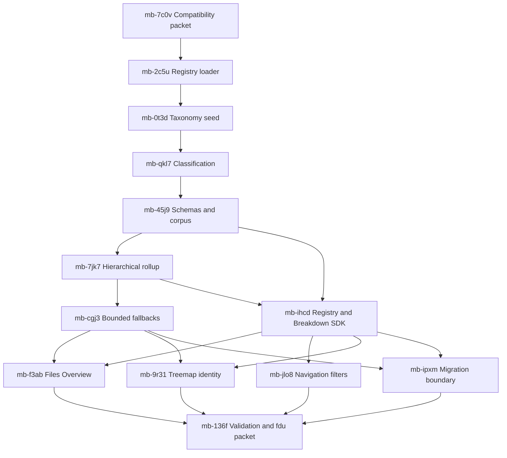

# Feature: Shared File Type Taxonomy and Bounded Breakdowns

**Date:** 2026-08-13 (last updated 2026-08-13)

**Author:** Metabrowser maintainers

**Status:** Implemented

**Documentation addendum:** The durable registry, classification, and aggregation
contract is consolidated as
[File Rollup Format v0.1](../../architecture/file-rollup-format/file-rollup-format.md).
This dated plan retains the implementation history and downstream adoption rationale;
the format document owns the current application-independent standard, and the
[development guide](../../../development.md#file-rollup-format-maintenance) owns the
reference implementation’s edit, regeneration, validation, export, and verification
workflow.

**Compatibility addendum (2026-08-14):** The transition-cycle plan below was wrong about
its own premise. Metabrowser serves an uncached page whose asset URLs carry
content-derived versions, so a browser cannot pair an old asset with a new route and the
mixed server-and-browser state those aliases protected against cannot occur.
Every derived alias and fallback described here — `type_tallies`, the `type_top` query
and SDK parameter, `ROLLUP_FILE_TYPE_NAMED_LIMIT`, `ROLLUP_FILE_TYPE_RAW_LIMIT`, the
`file-type-taxonomy-compat-v1` settings projection, and the `categories` and
`categoryForFile` SDK aliases — has been removed rather than deferred.
[Compatibility and Legacy Code](../../../development.md#compatibility-and-legacy-code)
now forbids adding a compatibility layer without a named consumer that cannot be updated
in the same commit.

## Overview

Metabrowser now groups common extensions into semantic families for its folder Files
summary, navigation filter, and Treemap colors.
fdu independently classifies files from a build-time TOML registry and reports types,
analyzer families, and raw extensions.
The two projects already solve adjacent parts of the same problem, but their names,
extension derivation, category semantics, and wire structures differ.

Define and document one versioned file-type registry and one portable breakdown model in
Metabrowser, then make both projects consume and emit those contracts.
The registry separates four concepts that must not be collapsed:

- a classifier **kind**, such as JavaScript, JSON Lines, C, or C++;
- a user-visible **family**, such as JavaScript, Log files, or C/C++;
- a top-level display and filter **group**, such as Code, Logs, Archives, or Media; and
- an analyzer **content family**, such as code, prose, markup, data, or binary.

This separation lets `.jsonl` appear under **Log files** while retaining structured-data
analysis, lets SVG appear under **Images** while retaining markup analysis, and lets fdu
distinguish C from C++ while Metabrowser presents one conservative C/C++ family.

The design deliberately combines the strongest part of each project.
Metabrowser’s general rollup is the product model: dual file/byte measures,
all/unignored populations, exact conservation, semantic parents, explanatory children,
and bounded fallback tails.
fdu contributes the more organized declaration and classifier structure: a TOML rule
registry, stable kind IDs, an independent content-family axis, evidence provenance, and
build-time compilation.
Metabrowser owns the reference product contract and documents it completely here; fdu
later adopts the same registry and exports the same UI-ready hierarchy.
fdu’s current flat type/family report is not the template for Metabrowser’s Overview
hierarchy.

The same work makes every family disclosure useful even when only one extension is
present, and makes the two unclassified populations inspectable:

- **No extension** expands to at most 20 exact basenames plus an **Others** child; and
- **Remaining types** expands to at most 20 raw logical extensions plus an **Others**
  child.

All parent rows retain exact file and byte conservation.
The bounded children explain a parent without turning response size into a function of
the number of unique filenames or extensions in a large tree.

This plan extends the implemented
[semantic file type family plan](../done/plan-2026-08-13-semantic-file-type-families.md)
and the original
[folder Files summary plan](../done/plan-2026-08-12-directory-file-type-summary.md).
The durable
[File Rollup Format v0.1](../../architecture/file-rollup-format/file-rollup-format.md)
is the normative application-independent contract for definitions, classification, and
conserved directory rollups.
This plan owns design rationale, implementation order, migration, testing, and
acceptance. Where transitional detail overlaps, the durable contract governs the
implemented format. It also aligns with fdu’s
[file-type registry](https://github.com/jlevy/fdu/blob/main/crates/fdu/rules/file-types.toml)
and its role as the future high-performance rollup engine.

## Implementation Outcome

Metabrowser now ships the complete reference implementation and a self-contained future
`fdu` handoff:

- `src/metabrowser/data/file-rollup-format/recommended-file-types.toml` is the reviewed
  declaration; `file_type_registry.py` validates it once and supplies immutable
  classification, projection, revision, and normalized fingerprint values.
- `fs_paths.py`, `inventory_rollup.py`, and `wire_models.py` implement the shared
  logical extension, conserved dual-population Breakdown v1, independent 20-child
  fallback caps, exact Others remainders, and strict registry-identity validation.
- `file_type_taxonomy.js`, `plugin_sdk.js`, and `types.d.ts` expose the same registry
  and Breakdown v1 contract to the browser.
  Overview, navigation, and Treemap consume those helpers rather than separate extension
  catalogs.
- `devtools/file_type_contract.py` generates and checks the normalized projection, JSON
  Schemas, metadata and invalid-declaration corpus, empty example, and a mixed
  high-cardinality aggregate.
  Its export mode creates a self-contained packet with a source-revision manifest for
  future `fdu` adoption.
- The durable
  [File Rollup Format v0.1](../../architecture/file-rollup-format/file-rollup-format.md)
  owns the machine structures, classifier rules, conservation rules, artifact names, and
  export boundary.

Legacy settings and tuple fields remain as derived additive aliases for one supported
transition cycle. Their eventual removal is tracked separately by `mb-me85`, so the
reference rollout does not silently break mixed server and browser assets.

## Goals

- Define one declarative, versioned TOML registry for shared file-type knowledge.
- Establish Metabrowser’s packaged registry, typed models, and documented wire formats
  as the reference contract, then preserve one byte-identical registry payload in fdu.
- Give every shared concept a stable machine ID independent of labels, icons, colors,
  and renderer names.
- Separate classifier kinds, display families, display groups, and analyzer content
  families so each project can use the same facts without weakening its own model.
- Align logical-extension derivation and matching precedence across Python, Rust, and
  browser consumers.
- Add the top-level groups **Logs**, **Archives**, and **Media** alongside Code,
  Documentation, and Data.
- Define Log files from `.log`, `.jsonl`, and `.ndjson` while preserving the structured
  content class of line-delimited JSON.
- Define common archive, image, video, audio, and font formats conservatively.
- Let every visible family expand to its contributing extension children, including a
  family with one contributing extension.
- Expand No extension into exact filename tallies and Remaining types into raw-extension
  tallies, with separate limits of 20 named children and an exact Others remainder.
- Keep count, apparent-byte, ignored-file, and percentage totals conserved at every
  hierarchy level.
- Give both packages the complete group, family, child, population, and metric structure
  required by the Files UI, even when one package exposes it through an API or CLI
  rather than rendering the browser interface itself.
- Give fdu compatible stable IDs and hierarchy exports for Rust, CLI, JSON/YAML, and
  Python consumers without replacing its richer content-detection evidence.
- Keep both projects’ outputs bounded, deterministic, cache-safe, and compatible during
  rollout.

## Non-Goals

- Copying or promising parity with GitHub Linguist’s exhaustive language database.
- Naming every extension or eliminating the Remaining types fallback.
- Treating icons, syntax highlighters, MIME types, file renderers, or plugin kinds as
  the file-type registry.
  They consume classification but remain separate systems.
- Making Metabrowser read file contents during inventory, rollup, navigation, or request
  handling.
- Removing fdu’s optional shebang, modeline, signature, generated, vendored, or
  documentation detection.
- Adding direct click-to-filter behavior to Overview rows in this change.
  Every child has a stable identity so that interaction can be added without changing
  the data model.
- Storing an unbounded exact-basename map in every fdu directory rollup.
  fdu may compute the explicit breakdown on demand until measurements justify another
  exact structure.
- Introducing a third repository, Git submodule, or network fetch into either build.
- Replacing Metabrowser’s conserved hierarchical rollup with fdu’s current flat report
  sections. fdu adapts the shared hierarchy as an additional projection.
- Making taxonomy labels a compatibility contract.
  IDs and matching behavior are the contract; labels are presentation metadata.

## Background

### Metabrowser Today

`src/metabrowser/file_type_filters.py` owns three display categories and a Python tuple
of semantic families.
It serializes the declarations into browser settings, and `static/file_type_taxonomy.js`
validates and exposes the browser runtime.

`FsEntry.ext` carries one bounded logical extension.
`inventory_rollup.py` classifies the complete selected subtree into known families and a
bounded raw tail.
The folder plugin renders family parents, canonical extension children,
No extension, and Remaining types.
It currently exposes a family disclosure only when two or more canonical children are
nonzero.

The current design has three limitations addressed here:

1. The catalog is Python source, so fdu cannot consume it directly.
2. The only declared top-level groups are Docs, Code, and Data; archives, logs, and
   media fall into a mix of existing families or raw rows.
3. No extension is one opaque row and Remaining types is one opaque aggregate after raw
   response bounding.

### fdu Today

fdu already has `crates/fdu/rules/file-types.toml`. `build.rs` validates a constrained
TOML shape, compiles it into native Rust data, and fingerprints normalized source for
cache and provenance invalidation.
Runtime classification does not parse configuration.

The current fdu registry is broader than Metabrowser’s. It includes common languages,
prose, markup, data, images, audio, video, archives, executables, fonts, and databases.
Its `Classification` records:

- a stable `FileTypeId`;
- a broad `ContentFamily` of code, prose, markup, data, binary, or unknown;
- detection source and confidence; and
- generated, vendored, and documentation flags.

fdu’s `types`, `extensions`, `families`, `languages`, and `documents` views are pure
readers over the index.
This is valuable and should remain.
The mismatch is semantic: fdu’s `ContentFamily` controls analysis behavior, whereas
Metabrowser’s category controls presentation and filtering.
Calling both values “family” obscures cases where they must differ.

### Important Current Divergences

| Concern | Metabrowser | fdu | Shared Direction |
| --- | --- | --- | --- |
| Declaration | Python tuples | TOML compiled by `build.rs` | Versioned TOML |
| Stable classified ID | Display family ID | `FileTypeId` kind | Kind plus optional display family |
| Broad grouping | Docs, Code, Data, Other | Code, Prose, Markup, Data, Binary, Unknown | Separate display group and content family |
| Compound extension | Final two eligible components | `.tar.*` special case only | One two-component rule |
| Case | Existing eligibility rejects uppercase suffixes | ASCII-lowercases suffixes | ASCII-lowercase before validation |
| Dotfile with suffix | All leading-dot names are extensionless | `.eslintrc.json` is `.json` | Bare dotfile has none; later dot introduces an extension |
| Known match | Longest declared suffix | Exact derived extension | Exact compound first, then longest component suffix |
| Filename match | Case-insensitive category extras | Exact `OsStr` | ASCII-case-insensitive declared basename |
| Content evidence | None on inventory path | Optional bounded cascade | fdu-only evidence enriches the same result shape |
| Unknown rows | Raw extension or aggregate tail | `unknown:.ext` kind | Stable raw extension plus Remaining types placement |

The changes in the last four rows are intentional compatibility changes and require
golden fixtures, cache invalidation, and release notes in their implementation PRs.

### Design Synthesis

Ownership follows the concern rather than one repository wholesale:

| Concern | Governing design |
| --- | --- |
| Folder breakdown hierarchy | Metabrowser’s family parents, extension children, two metrics, population scopes, and conservation |
| Fallback cardinality | Metabrowser’s aggregate-before-bound dual-metric selection, extended to two inspectable parents |
| Registry source format | A Metabrowser-owned reference registry using fdu’s clearer TOML array-of-tables organization |
| Classifier identity | fdu’s stable kind IDs, source, confidence, and content-family axis |
| Visible family/group taxonomy | Shared data reviewed for both products |
| Runtime loading | Build-time native tables in fdu; startup-time validated data plus injected JSON in Metabrowser |
| Human UI | Metabrowser’s design system and Overview/navigation interaction contracts |
| CLI and embedding | fdu adapters that export the Metabrowser-defined portable breakdown model |

The shared contract is therefore not “make Metabrowser use fdu’s current output.”
It is “fully specify Metabrowser’s richer rollup, registry, and typed hierarchy here
using fdu’s cleaner classifier organization, then let fdu adopt and produce that
hierarchy alongside its existing analytical reports.”

## Terminology

- **File facts:** Filesystem observations independent of classification: path, basename,
  kind, logical extension, byte measures, modification time, and ignore state.
- **Logical extension:** The normalized final one or two eligible suffix components,
  including the leading dot, such as `.js`, `.min.js`, or `.tar.gz`.
- **Kind:** The most specific stable classifier result used by fdu analysis, such as
  `javascript`, `json-lines`, `c`, or `cpp`.
- **Display family:** A user-facing aggregate such as JavaScript, Log files, Images, or
  C/C++. A kind may map to one display family; several kinds may share it.
- **Display group:** A top-level presentation and filter section such as Code, Logs, or
  Media.
- **Content family:** fdu’s analyzer class: code, prose, markup, data, binary, or
  unknown. It is orthogonal to display group.
- **Canonical extension:** The declared registry extension that matched a logical
  extension. `.min.js` has logical extension `.min.js` and canonical extension `.js`.
- **Detection source:** The evidence tier that selected a kind: filename, compound
  extension, extension, shebang, modeline, content ambiguity, signature, content probe,
  or unknown.
- **Population:** A named set over which metrics are tallied, such as `all`,
  `unignored`, or an fdu query’s `selected` population.
- **Remaining types:** All files with a logical extension that has no display-family
  match. It is a real conserved parent, not merely the overflow from response capping.
- **Others:** The exact aggregate child for values omitted by one 20-item child cap.

## Design Principles

1. **Keep facts, classification, and presentation distinct.** A filename and extension
   are observations. A kind is a classification.
   A display family and group are UI organization.
   A content family is analysis policy.
2. **Use one declaration, several generated adapters.** Python, Rust, and JavaScript may
   implement different runtime representations, but no adapter hand-maintains extension
   membership.
3. **Make stable IDs the interchange contract.** User-facing labels may improve without
   invalidating caches, filters, or serialized data.
4. **Classify once from the best evidence available.** Metabrowser uses metadata-only
   evidence. fdu may add bounded content evidence and reports which source won.
5. **Retain raw identity below every aggregate.** A family does not erase the logical or
   canonical extension.
   A display family does not erase fdu’s kind.
6. **Partition before presenting hierarchy.** Top-level type families, No extension, and
   Remaining types partition the file population exactly.
   Children explain their parent and are not added to the top-level conservation sum.
7. **Aggregate before bounding.** Parent totals are exact over the full scope; only
   emitted No extension and Remaining types children are capped.
8. **Keep bounds explicit and symmetric.** Both special parents expose at most 20 named
   children plus one Others row, selected by the same dual-metric ranking rule.
9. **Treat the registry as data, not a plugin renderer manifest.** It may use a familiar
   TOML array-of-tables shape, but its schema and lifecycle are independent of
   Metabrowser plugin `[[kind]]` rules.
10. **Do not make sharing depend on a developer’s workspace layout.** Builds are offline
    and self-contained; no relative path reaches into a sibling checkout.

## Shared Registry

### Ownership and Distribution

Metabrowser hosts the reference registry at
`src/metabrowser/data/file-rollup-format/recommended-file-types.toml` and the normative
format documentation in this repository.
That ownership keeps the taxonomy, rollup, SDK, navigation, and Files UI contracts
together while this design is established.
The file is packaged in the wheel, parsed once during server startup, and injected into
the browser as validated data.
It is never fetched from the network and never read on a request path.

fdu later adopts the same normalized registry at `crates/fdu/rules/file-types.toml`. It
compiles the data into native Rust and exports compatible classification and breakdown
values.
fdu may propose registry improvements, but the shared payload changes through the
Metabrowser reference contract first and is then synchronized into fdu.
This direction is organizational, not architectural: neither project acquires a runtime
dependency on the other.

The sharing workflow is deliberately small:

1. Edit and validate the reference Metabrowser registry and conformance corpus.
2. Copy their normalized forms into fdu through a checked sync command that accepts an
   explicit source checkout or release artifact.
3. Review the registry diff in both repositories.
4. Assert the same schema version, registry revision, normalized fingerprint, and
   conformance corpus in both projects.

The fingerprint is a drift and cache identity, not a security check.
The source Git revision or release is the supply-chain pin.
A future Metabrowser/fdu integration may replace Metabrowser’s local classifier with
fdu’s in-process API, but the registry and wire contracts remain independently
documented here so that swapping the engine does not change product semantics.

### Why TOML

TOML fits the existing fdu implementation and is in Python’s standard library through
`tomllib`. The source remains readable in code review, supports ordered arrays of
tables, and requires no browser parser because Metabrowser injects validated JSON.

The first schema uses a deliberately small, standard TOML subset: integers, strings,
booleans, string arrays, top-level scalars, and `[[group]]`, `[[family]]`, and
`[[kind]]` tables. fdu may keep a focused build-time parser if it validates the full
accepted subset against shared fixtures.
Adopting a general Rust TOML dependency is not required for this feature and would need
a separate supply-chain review.

### Registry Shape

The conceptual registry is:

```toml
schema_version = 1
registry_revision = 1
max_extension_components = 2

[[group]]
id = "code"
label = "Code"
order = 10

[[family]]
id = "javascript"
label = "JavaScript"
group = "code"
order = 100

[[kind]]
id = "javascript"
family = "javascript"
content_family = "code"
extensions = ["js", "jsx", "mjs", "cjs"]
filenames = []
shebangs = ["node", "deno", "bun"]
priority = 100

[[kind]]
id = "json-lines"
family = "log-files"
content_family = "data"
extensions = ["jsonl", "ndjson"]
filenames = []
shebangs = []
priority = 100
```

Registry fields have these meanings:

| Scope | Field | Contract |
| --- | --- | --- |
| Root | `schema_version` | Parser and structural contract; unsupported versions fail closed |
| Root | `registry_revision` | Monotone reviewed data revision included in outputs and cache identities |
| Root | `max_extension_components` | Exact logical-extension component cap; initially `2` |
| Group | `id` | Stable lowercase machine key |
| Group | `label` | UI and human-report label |
| Group | `order` | Stable cross-client display order |
| Family | `id` | Stable aggregate and palette key |
| Family | `label` | UI and human-report label |
| Family | `group` | Declared parent display group |
| Family | `order` | Stable tie-break order within its group |
| Kind | `id` | Stable classifier and fdu analysis key |
| Kind | `family` | Optional display family; absent kinds remain in Remaining types in the extension breakdown |
| Kind | `content_family` | Analyzer class independent of display placement |
| Kind | `extensions` | Normalized extension matchers without a leading dot |
| Kind | `filenames` | Exact basename matchers, ASCII-case-insensitive |
| Kind | `shebangs` | Optional fdu interpreter aliases |
| Kind | `priority` | Evidence tie-breaker; higher wins when a detection tier permits alternatives |

An optional `family` is important.
fdu may retain a useful analysis kind before the UI catalog decides it deserves a named
aggregate. Such files stay visible under Remaining types in Metabrowser rather than
forcing every fdu detector into the product taxonomy.

### Validation

Both loaders reject the same invalid declarations:

- unsupported schema version or nonpositive registry revision;
- duplicate or invalid IDs;
- duplicate group/family order within the same parent when ordering would be ambiguous;
- unknown group, family, or content-family references;
- empty labels;
- extensions with a leading dot, uppercase ASCII, empty components, too many components,
  or components outside the shared eligibility rule;
- duplicate exact extensions or filenames at the same evidence tier;
- a compound extension whose component count exceeds `max_extension_components`;
- a family with no kind and no future-compatible explicit membership;
- a kind with no extension, filename, shebang, or recognized content detector; and
- an equal-priority match that could produce two different kind IDs from the same
  evidence.

Validation errors name the table ID, field, value, and conflict.
fdu fails at build time.
Metabrowser fails at process startup before opening a listening socket.

## Shared Data Model and Formats

The cross-package contract has four layers.
Keeping them separate prevents a UI row, an analyzer decision, or a serialized report
from becoming the accidental source of truth for the others.

| Layer | Versioned form | Responsibility |
| --- | --- | --- |
| Declaration | `file-type-registry-v1` TOML | Stable kinds, display families, display groups, matching facts, order, and labels |
| Observation | `FileFacts` typed value | Filesystem facts such as basename, logical extension, byte measures, and ignore state |
| Classification | `FileClassification` typed value | Registry identities and evidence for one file, without aggregate or UI state |
| Aggregation | `file-type-breakdown-v1` JSON-compatible value | Conserved, bounded, UI-ready groups, parents, children, populations, and metrics |

Metabrowser defines all four here and implements the reference Python and browser
adapters. fdu implements equivalent Rust types and serializers.
Language-specific types may use idiomatic names and compact representations, but their
serialized IDs, nullability, metric meanings, ordering, and conservation rules do not
vary.

### Registry Projection

TOML is the reviewed declaration format.
Consumers do not parse TOML from arbitrary reports.
Each package validates it and can expose this JSON-compatible projection:

```json
{
  "schema": "file-type-registry-v1",
  "revision": 1,
  "fingerprint": "normalized-registry-identity",
  "max_extension_components": 2,
  "groups": [
    {"id": "code", "label": "Code", "order": 10}
  ],
  "families": [
    {"id": "javascript", "label": "JavaScript", "group_id": "code", "order": 100}
  ],
  "kinds": [
    {
      "id": "javascript",
      "family_id": "javascript",
      "content_family": "code",
      "extensions": [".js", ".jsx", ".mjs", ".cjs"]
    }
  ]
}
```

The projection includes leading dots on extensions because that is the runtime and UI
identity. Fields used only by a native classifier, such as shebang aliases or an
implementation-specific compiled matcher, need not be sent to a browser unless the
public SDK promises them.
Array order is authoritative and IDs remain the join keys.

### File Facts

The conceptual input to classification and rollup is:

```text
FileFacts
  basename: string or native filename value
  logical_extension: string or null
  apparent_bytes: nonnegative integer
  allocated_bytes: nonnegative integer or null
  ignored: boolean or null
```

Path and modification metadata may exist in the host inventory but are not file-type
classification inputs.
fdu retains native, potentially non-Unicode names internally; machine output applies its
established lossless filename encoding.
Metabrowser uses its existing safe wire-path representation.
A basename child key must round-trip through the host format rather than silently
replacing an undecodable value.

### Host Report Envelope

`file-type-registry-v1` and `file-type-breakdown-v1` are composable values, not entire
application responses.
An fdu machine report that Metabrowser can ingest has this conceptual envelope:

```json
{
  "schema": "fdu-report-vN",
  "file_types": {
    "registry": {"schema": "file-type-registry-v1"},
    "breakdown": {"schema": "file-type-breakdown-v1"}
  }
}
```

Metabrowser may send the registry once with bootstrap settings and breakdowns on each
rollup response; fdu may bundle both into one standalone report.
The breakdown always carries registry identity, so a consumer rejects or refreshes a
breakdown whose revision and fingerprint do not match its registry projection.
This supports the same Files UI structure without duplicating labels, ordering, or
family membership into every directory payload.

The implementations use the same type boundaries:

| Portable concept | Metabrowser Python/browser | fdu Rust/Python |
| --- | --- | --- |
| Registry | `FileTypeRegistry` / immutable `mb.fileTypes` projection | compiled `FileTypeRegistry` / serialized projection |
| File observation | existing `FsEntry` adapted to `FileFacts` | indexed entry adapted to `FileFacts` |
| Classification | `FileTypeClassification` | `Classification` with shared accessors |
| Metrics | `FileTypeMeasure` keyed by population | `FileTypeMeasure` keyed by population |
| Group | `FileTypeGroupBreakdown` | `FileTypeGroupBreakdown` |
| Family | `FileTypeFamilyBreakdown` | `FileTypeFamilyBreakdown` |
| Extension child | `FileTypeExtensionBreakdown` | `FileTypeExtensionBreakdown` |
| Bounded fallback | `FileTypeFallbackBreakdown` and optional Others | `FileTypeFallbackBreakdown` and optional Others |
| Root | `FileTypeBreakdown` | `FileTypeBreakdown` |

This table specifies responsibilities, not generated source sharing.
No package defines the same concept once for rollups and again for a renderer.
The browser view model may add expansion state, percentages, formatted sizes, icons, and
palette keys, but those are derived presentation values and never serialized back as
classification facts.

## Extension and Matching Contract

### Logical Extension Derivation

Python and Rust implement the same filename-only algorithm:

1. Read the final basename without decoding or normalizing the rest of the path.
2. A leading dot alone does not introduce an extension.
   `.gitignore` is extensionless; `.eslintrc.json` has `.json` because a later dot
   introduces a suffix.
3. Consider at most the final `max_extension_components` dotted components.
4. ASCII-lowercase each component before validation.
5. Retain consecutive trailing components that are nonempty, alphanumeric, and no more
   than 12 characters each.
6. Return no extension if the final component is ineligible.
7. Include the leading dot in runtime and wire values.

Required examples are:

| Filename | Logical extension |
| --- | --- |
| `bundle.js.map` | `.js.map` |
| `bundle.map` | `.map` |
| `bundle.umd.min.js.map` | `.js.map` |
| `types.d.ts.map` | `.ts.map` |
| `bundle.umd.min.js` | `.min.js` |
| `archive.tar.gz` | `.tar.gz` |
| `release.v2.zip` | `.v2.zip` |
| `Photo.JPEG` | `.jpeg` |
| `.gitignore` | none |
| `.eslintrc.json` | `.json` |

This supersedes fdu’s `.tar`-only compound special case and Metabrowser’s rejection of
uppercase suffixes and every leading-dot filename.

### Metadata Matching Precedence

The shared metadata cascade is deterministic:

1. Match a declared basename ASCII-case-insensitively.
2. Match the complete logical extension exactly.
   This makes `.tar.gz` an archive before considering `.gz`.
3. If no exact compound match exists, match the longest declared suffix on a component
   boundary. This makes `.min.js` JavaScript through `.js`.
4. Prefer higher priority only within one evidence tier.
5. Preserve the logical extension, canonical matched extension, winning kind ID, display
   family ID, display group ID, and content family in the result.
6. If no display-family match exists, preserve the raw logical extension for Remaining
   types.

fdu may continue from the metadata cascade with bounded content evidence for unresolved
or explicitly ambiguous cases.
It records the winning detection source and confidence.
Metabrowser stops after metadata evidence.
The two products can therefore differ in kind specificity while still agreeing on
extension facts and all metadata-only cases.

### File Classification Shape

The portable classification model is conceptually:

```text
FileClassification
  logical_extension: string or null
  canonical_extension: string or null
  kind_id: string or null
  family_id: string or null
  group_id: string
  content_family: string
  detection_source: string
  confidence: string
  registry_revision: integer
  registry_fingerprint: string
```

`group_id` falls back to `other`; `content_family` falls back to `unknown`. Metabrowser
need not serialize every field on every tree row.
The shape defines the adapter boundary and fdu output; memory-sensitive consumers may
retain only the stable inputs needed to rederive the rest from the immutable registry.

Classification does not by itself choose a breakdown row.
The shared breakdown routing order is:

1. A file with no logical extension contributes to No extension, even if an exact
   basename or fdu content evidence assigned a known kind.
   Its classification remains available for analysis and filtering, while its filename
   remains visible in the extension-oriented Files summary.
2. A file with a logical extension and a display family contributes to that family.
   Its child key is the canonical matched extension when present and otherwise the
   preserved logical extension.
3. A file with a logical extension and no display family contributes to Remaining types
   under its logical extension.

This precedence guarantees that every family parent can be explained entirely by
extension children and that No extension and Remaining types remain true partitions
rather than labels for only some unknown files.

## Initial Display Taxonomy

### Top-Level Groups

The registry declares this initial order:

| ID | Label | Purpose |
| --- | --- | --- |
| `code` | Code | Programming, styling, query, and build languages |
| `docs` | Documentation | Human-facing prose and document formats |
| `data` | Data | Structured records, configuration, tables, and databases |
| `logs` | Logs | Append-oriented textual and structured logs |
| `archives` | Archives | Compressed streams and multi-file containers |
| `media` | Media | Images, video, audio, and fonts |
| `other` | Other | System fallback containing No extension and Remaining types |

`other` is declared for ordering and labeling but is the only fallback group.
A normal family does not target it merely to avoid making a taxonomy decision; a kind
without a display family remains in Remaining types.

### Existing Families

The shared registry carries forward the implemented Metabrowser families and reconciles
them with fdu kinds:

- Code includes Python, JavaScript, TypeScript, CSS, HTML, Rust, Go, Java, Kotlin,
  Swift, C/C++, C#, Ruby, PHP, Scala, Clojure, Elixir, Erlang, Haskell, Lua, Julia,
  Dart, Vue, Svelte, Shell, PowerShell, and SQL.
- Documentation includes Markdown, Plain text, reStructuredText, AsciiDoc, Org, PDF,
  Word, Rich Text, OpenDocument, and EPUB.
- Data includes JSON, YAML, TOML, INI, Delimited text, XML, Parquet, Arrow, Avro, ORC,
  Protocol Buffers, GraphQL, and SQLite.

fdu may keep more granular kinds beneath these families.
C and C++ retain distinct kind IDs but share C/C++; Sass-like stylesheet kinds may share
CSS; and exact build-file kinds may remain separate even when their extension breakdown
placement is No extension.

JSON changes from `.json`, `.jsonl`, and `.ndjson` to `.json` alone.
JSON Lines and newline-delimited JSON move into Log files as required below.

### Logs

The initial Logs group contains one display family:

| Family | Kinds | Extensions | Content family |
| --- | --- | --- | --- |
| Log files | Plain log, JSON Lines | `.log`, `.jsonl`, `.ndjson` | Prose for `.log`; data for `.jsonl` and `.ndjson` |

Do not include `.out`, `.trace`, or extensionless names merely because they sometimes
hold logs. Their meanings are too broad for metadata-only classification.
fdu may still recognize a log from bounded content in a future registry revision.

### Archives

The initial Archives group contains one display family:

| Family | Extensions |
| --- | --- |
| Archives | `.zip`, `.tar`, `.tar.gz`, `.tar.bz2`, `.tar.xz`, `.tar.zst`, `.tgz`, `.tbz`, `.tbz2`, `.txz`, `.tzst`, `.gz`, `.bz2`, `.xz`, `.zst`, `.7z`, `.rar` |

Exact compound matches win, so `.tar.gz` is the canonical extension child when present.
A compressed non-tar artifact such as `notes.md.gz` derives `.md.gz`, then matches the
`.gz` archive suffix while preserving `.md.gz` as its logical extension.

Java archives such as `.jar`, `.war`, and `.ear` remain fdu kinds without joining this
display family in the first revision; they combine archive structure with executable or
package semantics and deserve a separate review.

### Media

The initial Media group contains four display families:

| Family | Extensions | Content family notes |
| --- | --- | --- |
| Images | `.jpg`, `.jpeg`, `.png`, `.gif`, `.webp`, `.avif`, `.heic`, `.heif`, `.jxl`, `.bmp`, `.ico`, `.tif`, `.tiff`, `.svg`, `.apng` | Binary except SVG, which remains markup |
| Videos | `.mp4`, `.m4v`, `.mov`, `.mkv`, `.webm`, `.avi`, `.wmv`, `.mpeg`, `.mpg`, `.m2v`, `.ogv` | Binary |
| Audio | `.mp3`, `.wav`, `.flac`, `.aac`, `.m4a`, `.ogg`, `.oga`, `.opus`, `.aif`, `.aiff`, `.wma` | Binary |
| Fonts | `.ttf`, `.otf`, `.woff`, `.woff2` | Binary |

Raw camera formats are deliberately absent because extensions such as `.raw` are
ambiguous. Playlist, subtitle, and project formats are also out of scope for the first
revision. They remain visible under Remaining types.

## Portable Breakdown Model

### Metric Values and Populations

One tally carries named populations rather than baking Metabrowser’s ignored-file toggle
or fdu’s selection grammar into the schema:

```json
{
  "all": {"files": 150, "bytes": 10485760},
  "unignored": {"files": 145, "bytes": 9437184}
}
```

Each population value requires `files` and apparent `bytes`. fdu may add
`allocated_bytes`. Future additive metrics use new named fields or a separate metrics
object; consumers ignore fields they do not understand.

Metabrowser emits `all` and `unignored`. fdu emits `selected` and, when the report
retains an unfiltered denominator, `all`. The enclosing host envelope documents which
populations it supplies.
Every row in one breakdown has the same population keys.

### Hierarchy

The portable hierarchy is:

```json
{
  "schema": "file-type-breakdown-v1",
  "registry": {
    "schema_version": 1,
    "revision": 1,
    "fingerprint": "normalized-registry-identity"
  },
  "metrics": {
    "all": {"files": 200, "bytes": 20971520},
    "unignored": {"files": 190, "bytes": 19922944}
  },
  "groups": [
    {
      "id": "code",
      "families": [
        {
          "id": "javascript",
          "metrics": {
            "all": {"files": 150, "bytes": 10485760},
            "unignored": {"files": 145, "bytes": 9437184}
          },
          "extensions": [
            {
              "extension": ".js",
              "metrics": {
                "all": {"files": 150, "bytes": 10485760},
                "unignored": {"files": 145, "bytes": 9437184}
              }
            }
          ]
        }
      ]
    }
  ],
  "no_extension": {
    "metrics": {
      "all": {"files": 20, "bytes": 1048576},
      "unignored": {"files": 18, "bytes": 1048576}
    },
    "filenames": [
      {
        "basename": "Makefile",
        "metrics": {
          "all": {"files": 20, "bytes": 1048576},
          "unignored": {"files": 18, "bytes": 1048576}
        }
      }
    ],
    "others": null
  },
  "remaining_types": {
    "metrics": {
      "all": {"files": 30, "bytes": 9437184},
      "unignored": {"files": 27, "bytes": 9437184}
    },
    "extensions": [
      {
        "extension": ".bin",
        "metrics": {
          "all": {"files": 30, "bytes": 9437184},
          "unignored": {"files": 27, "bytes": 9437184}
        }
      }
    ],
    "others": null
  }
}
```

Labels and ordering come from the matching registry projection.
Groups and families are nested in display order so a renderer can stream the same
hierarchy without rebuilding membership; empty groups are omitted.
No extension and Remaining types are named root members because they have distinct child
shapes, and the registry places both in the Other section.
Filename children carry their exact basename as both key and label.
Remaining-type children carry their raw logical extension.
The Others child uses a reserved system key and includes metrics plus
`omitted_distinct_values` so a consumer can say how much detail was folded away without
claiming those values are one type.

### Partition and Conservation Invariants

For every emitted population and metric:

1. The root total equals the sum of all family parents across all groups, No extension,
   and Remaining types.
   Group nodes are structural and do not add another metric level.
2. A family parent equals the sum of all its emitted canonical-extension children.
   Family extension children are complete and are not capped.
3. No extension equals the sum of its at most 20 filename children plus its optional
   Others child.
4. Remaining types equals the sum of its at most 20 raw-extension children plus its
   optional Others child.
5. A file contributes to exactly one top-level partition row.
6. Children never contribute again when checking top-level conservation.
7. Toggling ignored visibility selects another already-emitted population; it never
   changes ranking membership or requires another crawl.

### Child Selection

No extension basenames and Remaining types extensions use the same ranking rule already
proven for Metabrowser raw types.
For each value, compute its greatest share across file count and apparent bytes for
every emitted population.
Metabrowser therefore scores all-file count, all apparent bytes, unignored-file count,
and unignored apparent bytes.
fdu applies the identical rule to `all`, `selected`, or any other populations present in
its breakdown. Optional allocated bytes do not affect shared ranking, which keeps child
membership identical in consumers that only understand the required metrics.

Order by greatest share, byte share, file share, and stable key.
Keep the first 20. This ensures a many-small-files value and a one-large-file value can
both survive the bound, and a value important only when ignored files are hidden is not
discarded.

The limit is a named registry-independent product setting, not a TOML taxonomy value.
The shared default and hard maximum are 20. The response remains valid with a lower
consumer-requested limit, including zero, as long as Others conserves the omitted
population.

## Metabrowser User Experience

### Folder Files Summary

The folder Files summary uses registry group order rather than hard-coded category IDs.
Each group heading appears only when it has a nonzero row in the active population.

Every family parent with at least one contributing extension has the standard trailing
gray disclosure chevron and starts collapsed.
This includes a singleton family.
For example, a CSS family containing only `.css` in the selected folder expands to one
`.css` row. A family parent remains text-only; extension children retain their shared
file identity icons and family color.

No extension and Remaining types are ordinary aggregate parents in the Other group:

- No extension uses the generic file icon and expands to exact basenames.
  A filename child uses the same icon resolver as a navigation file row, so `README`,
  `Makefile`, and an unknown name receive consistent identities.
- Remaining types uses the generic file icon and expands to raw logical extensions.
  Each extension child uses the matching file icon with the generic file icon as the
  fallback.
- An Others child is neutral, non-disclosable, and not presented as a filterable file
  type.

Expanded state is keyed by stable family or system-parent ID and survives live tally
updates while that row remains present.
It is local view state and is not encoded in the URL in this phase.

The existing totals-first layout, dual Files and Size columns, percentages, boldness by
size, ignored toggle, responsive width, and empty-directory state do not change.

### Navigation Type Filter

The type chooser becomes entirely registry-driven:

1. top-level display groups in declared order;
2. present display families in declared group and family order; and
3. present canonical and raw extensions ranked by the active population.

Selecting a display group selects all declared member extensions and exact filenames
reachable through its families and kinds.
Selecting a family selects all of its declared extension members.
Selecting an extension remains exact at the canonical member level and continues to
match declared compound tails.

Logs, Archives, and Media are peer group choices rather than being hidden under Data or
Other. Images, Videos, Audio, and Fonts appear as Media families.
The filter continues to operate over loaded navigation rows with server-owned
complete-index tallies.

Directly clicking an Overview child to set this filter is deferred, but every child
model carries the same token the filter already understands.

### Color and Icon Identity

- A display family owns one palette key, `family:<id>`, across Files and Treemap.
- A group does not own a color; group headings remain chrome.
- Canonical extension children share the parent family color.
- Raw Remaining types children retain raw-extension palette keys.
- No extension filename children use a neutral or filename-derived fallback, not a
  misleading language color.
- File icons remain extension or basename identities.
  Families and totals do not acquire invented icons.

## Future `fdu` Integration

### Classification

fdu compiles the shared groups, display families, kinds, and match tables in `build.rs`.
`Classification` keeps its current `file_type`, `family`, source, confidence, and flags
for compatibility, while adding explicit shared identities:

- `kind_id` is represented by the existing `FileTypeId`;
- `display_family_id` is optional;
- `display_group_id` falls back to `other`;
- the existing `ContentFamily` remains the analyzer content family; and
- logical and canonical extensions are available to reporting adapters.

The existing `ContentFamily` type is not renamed to `DisplayGroup` or reused for UI
placement. Cache and report code that means analyzer behavior continues to use it.

### Reports and CLI

fdu retains its current flat `types`, `extensions`, `families`, `languages`, and
`documents` views. Their meanings are useful and composable.
The portable hierarchy is the Metabrowser-style conserved rollup adapted into a new
file-type breakdown section in machine output and a grouped human view, rather than a
flattening of Metabrowser’s model or a silent change to an existing fdu schema version.

The implementation should choose the shortest CLI spelling consistent with fdu’s view
axis, with `file-types` as the planned wire/view label.
It must not add a one-off flag.
The section uses the portable IDs and hierarchy above and may add `allocated_bytes` and
provenance fields without removing the required file/apparent-byte measures.

The Rust library exposes the typed breakdown builder.
`fdu-py` returns the same stable structure to Python so Metabrowser can adopt it later
without parsing terminal output.
The CLI JSON/YAML renderer serializes that structure directly; the human renderer uses
registry labels and fdu’s existing size formatting.

### Performance and Cache Behavior

The registry fingerprint remains part of fdu’s engine and content provenance.
Any rule, schema, matching, or extension-derivation change invalidates classifications
and dependent cache data.

The initial exact filename breakdown may traverse retained file entries at report time,
as fdu’s type metrics already do.
It must not add an unbounded basename map to every ancestor rollup without measurement.
If the view later needs an O(1) unfiltered path, evaluate an exact compact index or a
mergeable bounded summary separately; do not label an approximate top list as exact.

## Metabrowser File- and Function-Level Plan

### Registry and Classification

- Add `src/metabrowser/data/file-rollup-format/recommended-file-types.toml` as the
  packaged reference registry.
- Add `src/metabrowser/file_type_registry.py` with typed immutable group, family, kind,
  registry, match, and classification values.
- Add `load_file_type_registry()` to parse with `tomllib`, validate once, and return one
  immutable registry.
- Add `classify_file_type(name, extension)` and focused lookup helpers for kind, family,
  group, canonical extension, distribution key, and filter tokens.
- Refactor `src/metabrowser/file_type_filters.py` into a compatibility facade that
  derives `FILE_TYPE_CATEGORIES`, `FILE_TYPE_FAMILIES`, and `FILTER_TYPE_PRESETS` from
  the registry during the transition.
- Update `src/metabrowser/fs_paths.py::derive_ext` to the shared case, dotfile,
  component, and length contract.
- Keep walker and watcher construction centralized through `FsEntry.for_observed_file`
  so both producers receive identical extension facts.

### Aggregation and Wire Models

- Extend `_SubtreeAggregate` in `inventory_rollup.py` with exact no-extension basename
  counters for all and unignored file and byte populations.
- Replace `_serialize_type_tallies()` with a typed breakdown builder that partitions
  every extension through the shared registry before applying child caps.
- Add one reusable dual-population selector for No extension basenames and Remaining
  types extensions.
- Emit complete family extension children, capped special-parent children, exact Others
  metrics, and registry identity.
- Replace tuple-heavy semantic rows in `wire_models.py` with named TypedDict structures
  matching the nested groups, family children, special parents, and metric populations
  of `file-type-breakdown-v1`; retain legacy `type_tallies` and `ext_tallies` during one
  mixed-version transition.
- Add a typed `file-type-registry-v1` JSON projection and assert that every breakdown
  identifies the exact registry used to build it.
- Extend `InventoryIndex.navigation_tallies()` to derive dynamic group and family
  tallies from the same registry and classification helpers.
- Add named settings for the filename and raw-extension child limits, both defaulting to
  and capped at 20.
- Update `/api/rollup` query parsing and the public SDK rollup options without removing
  the existing `type_top` compatibility parameter until every built-in consumer uses the
  new names.

### Browser Runtime and Navigation

- Refactor `static/file_type_taxonomy.js` into a strict runtime for groups, families,
  kinds, registry identity, and matching parity.
- Remove hard-coded Docs/Code/Data unions and validation branches; validate IDs against
  the injected registry.
- Extend `static/types.d.ts` and the immutable `mb.fileTypes` facade with groups, kinds,
  display-family matches, and registry metadata.
- Update `app.js::filterTypePresets()`, `filterTypeFamilies()`,
  `filterTypePresetSections()`, and filter tally ingestion to use registry order and the
  new groups.
- Preserve legacy settings and tally fallbacks for mixed server/browser assets, then
  remove the compatibility path only in a later deliberate cleanup.

### Folder Overview

- Extend `folder/file_type_summary_model.js` normalizers for named metric populations,
  singleton family disclosures, No extension filename children, Remaining types raw
  children, and Others rows.
- Change the model’s disclosure rule from two children to one child.
- Use registry-declared group order instead of the hard-coded category tuple.
- Extend `folder/distribution_view.js` so family and special parents share the same
  accessible disclosure behavior and controlled-row bookkeeping.
- Resolve filename child icons from the basename and raw child icons from the extension.
- Keep family parents iconless; keep the two special parents and Others on the neutral
  generic identity.
- Update `file_type_summary.css` only where a filename or Others child needs a tokenized
  indentation or neutral treatment not covered by existing child-row styles.
- Keep all renderer state disposable and preserve expanded keys across live updates.

### Documentation

- Update `docs/architecture.md` with registry ownership, parsing boundary, portable
  classification, and breakdown conservation.
- Update `docs/design-system.md` with dynamic group order, singleton disclosures,
  special-parent children, icons, color identity, and cap behavior.
- Update `docs/plugins.md` and SDK types with registry metadata and additive file-type
  helpers.
- Add a normative registry and interchange-format reference in this repository; other
  design and SDK documents link to it rather than duplicating the full seed list or
  schema.
- Document the checked synchronization and conformance process by which fdu adopts a
  reviewed Metabrowser registry revision.
- Add release notes for extension-derivation and JSONL group changes.

## Future `fdu` File- and Function-Level Plan

### Registry Compiler

- Replace `crates/fdu/rules/file-types.toml` through the checked synchronization path
  with the reviewed Metabrowser registry revision, preserving fdu-only classifier facts
  represented by the shared kind schema.
- Extend the typed build-side records in `crates/fdu/build.rs` and keep all validation
  before code generation.
- Generate static group, family, kind, extension, filename, and shebang tables plus the
  normalized registry fingerprint and revision.
- Add build-script tests or an extracted parser module so malformed shared fixtures are
  tested directly rather than only by failing Cargo builds.

### Classifier

- Update `crates/fdu/src/classify.rs::derive_ext` and its native unit helpers to the
  shared two-component algorithm without losing non-Unicode filename support.
- Update `classify_path_with_prefix()` to run exact compound matching before longest
  declared suffix matching.
- Add display family/group and canonical extension accessors while preserving existing
  `FileTypeId`, `ContentFamily`, detection source, confidence, and flags.
- Keep `file_type_detection.rs` bounded and independent of registry parsing.
- Split JSON from JSON Lines and retain the correct content family for each kind.

### Query and Serialization

- Add typed `FileTypeMeasure`, population metrics, nested group and family rows,
  extension children, special parents, and `FileTypeBreakdown` values in the
  query/report model.
- Add a pure breakdown builder beside the existing metric-summary builder in
  `query/query_report.rs`.
- Add the view-axis enum and CLI parser spelling in `query.rs` and `cli.rs` without a
  new one-off flag.
- Add JSON, YAML, and human rendering in `report_format.rs` with a versioned schema
  label.
- Expose the same typed structure from `crates/fdu-py/src/lib.rs`.
- Export `file-type-registry-v1` beside `file-type-breakdown-v1` so Metabrowser can
  consume a self-describing fdu report without translating fdu’s flat views.
- Include registry revision/fingerprint in report provenance and snapshot/content cache
  invalidation where classification affects retained results.

### Documentation and Goldens

- Update `fdu-design-principles.md` to distinguish display group from content family.
- Document the registry schema and maintenance workflow near the TOML source.
- Update CLI help, Rust API docs, Python binding docs, and machine-schema documentation.
- Add focused human, JSON, YAML, type, extension, and content-analysis goldens.

## Cross-Project Conformance

Metabrowser owns a small reference classification corpus and fdu vendors the same
normalized cases. Each case contains a basename and expected metadata-only facts:

- logical extension;
- canonical extension;
- kind ID;
- display family ID;
- display group ID; and
- content family.

Required cases cover:

- every declared extension and filename;
- uppercase suffixes and case-insensitive declared basenames;
- bare dotfiles and dotfiles with a later suffix;
- one-, two-, and longer dotted names;
- exact compounds before suffix fallbacks;
- `.min.js`, `.d.ts`, `.js.map`, and `.tar.gz` boundaries;
- JSON versus JSON Lines;
- SVG’s Media/Images placement with markup content family;
- C/C++ shared display family with distinct fdu kinds;
- unknown extension and extensionless fallback; and
- invalid registry fixtures for every validation class.

The Python and Rust tests consume the same fixture shape and compare complete expected
records. The browser parity test consumes the server-serialized registry and the same
metadata cases. A registry update is incomplete until all three implementations agree.

## Implementation Plan

This epic implements the reference contract and publishes a complete adoption packet.
Changes inside the `fdu` repository are a later downstream effort using the
application-independent
[File Rollup Format v0.1](../../architecture/file-rollup-format/file-rollup-format.md);
they are not hidden inside a Metabrowser bead.

### Bead Dependency Graph



### Bead Map

| Order | Bead | Outcome | Blockers |
| --- | --- | --- | --- |
| 1 | `mb-7c0v` | Durable registry, interchange, and `fdu` compatibility documents | None |
| 2 | `mb-2c5u` | Packaged Registry v1 source, immutable loader, validation, and compatibility facade | `mb-7c0v` |
| 3 | `mb-0t3d` | Reconciled Code, Documentation, Data, Logs, Archives, Media, and Other taxonomy | `mb-2c5u` |
| 4 | `mb-qkl7` | Shared logical-extension and metadata-classification behavior | `mb-0t3d` |
| 5 | `mb-45j9` | Machine schemas, conformance corpus, fingerprints, and drift tooling | `mb-qkl7` |
| 6 | `mb-7jk7` | Typed conserved Registry v1 hierarchical directory breakdown | `mb-45j9` |
| 7 | `mb-cgj3` | Bounded No extension and Remaining types children with exact Others | `mb-7jk7` |
| 8 | `mb-ihcd` | Public immutable registry projection and Breakdown v1 SDK | `mb-45j9`, `mb-7jk7` |
| 9 | `mb-f3ab` | Complete registry-driven Files Overview | `mb-cgj3`, `mb-ihcd` |
| 10 | `mb-jlo8` | Registry-driven navigation filter hierarchy | `mb-ihcd` |
| 11 | `mb-9r31` | Treemap identity aligned to every registry family | `mb-cgj3`, `mb-ihcd` |
| 12 | `mb-ipxm` | Legacy wire, saved-filter, cache, and mixed-version migration boundary | `mb-cgj3`, `mb-ihcd` |
| 13 | `mb-136f` | Full validation plus normalized, versioned `fdu` adoption packet | `mb-f3ab`, `mb-jlo8`, `mb-9r31`, `mb-ipxm` |

### Phase 1: Reference Contract and Classification

- [x] `mb-7c0v`: publish the durable compatibility documents.
- [x] `mb-2c5u`: implement and package Registry v1.
- [x] `mb-0t3d`: seed and reconcile the shared taxonomy.
- [x] `mb-qkl7`: align logical-extension derivation and metadata matching.
- [x] `mb-45j9`: publish schemas, conformance cases, and checked drift tooling.

### Phase 2: Metabrowser Data Path and UI

- [x] `mb-7jk7`: build the conserved hierarchical rollup.
- [x] `mb-cgj3`: add exact bounded fallback children.
- [x] `mb-ihcd`: expose Registry and Breakdown v1 through the SDK.
- [x] `mb-f3ab`: render the complete Files Overview hierarchy.
- [x] `mb-jlo8`: derive navigation filters from the registry.
- [x] `mb-9r31`: align Treemap type identities.
- [x] `mb-ipxm`: complete compatibility and cache migration.

### Phase 3: Validation and Downstream Handoff

- [x] `mb-136f`: validate all Metabrowser surfaces, finalize durable documentation, and
  publish the registry, schemas, corpus, fingerprints, and captured examples that a
  later `fdu` change adopts.

## Testing Strategy

### Registry and Classification

- Parse and validate the production registry in Python and Rust.
- Pin normalized registry revision and fingerprint behavior without treating the
  fingerprint as a security primitive.
- Test every validation failure with one minimal fixture and a precise diagnostic.
- Run the shared conformance corpus in Python, Rust, and browser JavaScript.
- Test non-Unicode filename behavior on fdu’s supported native platforms.
- Test all two-component, case, dotfile, exact-compound, and suffix-fallback boundaries.

### Aggregation

- Prove top-level conservation for files and bytes in every population.
- Prove each family equals all canonical extension children.
- Prove each special parent equals its displayed children plus Others.
- Cover fewer than, exactly, and more than 20 distinct names/extensions.
- Cover count-heavy, byte-heavy, ignored-only, and mixed populations so dual ranking
  cannot discard an important value.
- Cover all-zero-byte files, empty directories, ignored-only directories, truncated
  inventories, and live add/change/remove events.
- Assert response size is bounded independently for basename and raw-extension
  cardinality.

### Metabrowser UI

- Test registry-driven group order and omission of empty groups.
- Test Logs, Archives, and Media labels, families, shared colors, and file icons.
- Test singleton and multi-extension family expansion, collapse, keyboard activation,
  `aria-expanded`, and `aria-controls`.
- Test No extension filename children, Remaining types extension children, and neutral
  Others rows.
- Test expansion-state preservation and disposal through live updates and renderer
  replacement.
- Test ignored-file toggling without row identity or cap-membership drift.
- Validate wide and compact responsive layouts in light and dark themes.

### fdu

- Test build-time generation and classification without runtime TOML parsing.
- Test existing `types`, `extensions`, `families`, `languages`, and `documents` views
  for deliberate compatibility.
- Add Rust API, CLI human, JSON, YAML, and Python binding coverage for the new
  breakdown.
- Test report provenance and cache invalidation after a registry revision change.
- Run the full `make check` gate in fdu and `make verify` in Metabrowser.

## Backward Compatibility and Migration

- Metabrowser retains `extensions`, existing semantic `type_tallies`,
  `canonical_extensions`, `type_families`, and `type_presets` during one additive wire
  transition. New clients prefer `file_type_breakdown` and registry identity.
- The `mb.fileTypes` SDK adds groups, kinds, and metadata without removing existing
  categories, families, or helpers.
  Compatibility names become derived aliases.
- Saved filter tokens based on canonical extensions remain valid.
  Existing family IDs remain stable wherever the semantic meaning is unchanged.
- `.jsonl` and `.ndjson` intentionally move from JSON/Data to Log files/Logs.
  Release notes call out saved family/group filter behavior.
- Uppercase extensions and dotfiles with later suffixes intentionally gain recognition.
  Bare dotfiles remain extensionless.
- fdu keeps existing flat views and `ContentFamily` semantics.
  The new display fields and breakdown view are additive; any machine-schema change uses
  a new schema label.
- fdu’s registry fingerprint invalidates cached classification results after the new
  schema and derivation rules land.
- Metabrowser retains the reference registry and contract documentation even if an fdu
  in-process engine later supplies classifications or rollups.
  Generated runtime tables may move behind that boundary without moving product
  semantics out of this repository.

## Rollout Plan

1. Land the reference schema, registry, conformance corpus, Python/browser adapters, and
   normative format documentation in Metabrowser.
2. Add the portable breakdown wire model while retaining legacy fields.
3. Switch Metabrowser Overview and navigation to the new model and validate the browser
   manually across representative directories.
4. Sync the reviewed registry and corpus into fdu, then add its compiler and classifier
   support.
5. Add fdu’s compatible registry and grouped breakdown exports across Rust, CLI machine
   and human formats, and Python.
6. Exercise Metabrowser against captured fdu exports before selecting any direct engine
   integration.
7. Observe one compatibility cycle, then create separate cleanup beads for legacy wire
   aliases rather than removing them inside the feature rollout.

Each repository lands independently green.
Metabrowser never depends on an unpublished fdu checkout, and fdu never depends on
Metabrowser.

## Acceptance Criteria

- Metabrowser documents and ships the reference registry, classification, and breakdown
  formats; fdu ships the same normalized registry revision and passes the same metadata
  conformance corpus.
- The registry has explicit kinds, display families, display groups, and analyzer
  content families with stable IDs.
- Logical extension derivation agrees across Python and Rust for all boundary fixtures.
- Code, Documentation, Data, Logs, Archives, Media, and Other are registry-declared and
  appear in the same order across Metabrowser surfaces.
- `.log`, `.jsonl`, and `.ndjson` appear under Log files; `.jsonl` and `.ndjson` retain
  a data content family in fdu.
- The declared archive and media formats classify into the intended display families.
- Every nonempty family row can expand, including a family with one contributing
  extension.
- No extension shows at most 20 exact basename children plus an exact Others row.
- Remaining types shows at most 20 raw logical-extension children plus an exact Others
  row.
- All file and byte totals conserve at root, parent, child, ignored, and unignored
  levels.
- Unknown values remain visible and honestly labelled; no cap silently drops metrics.
- Metabrowser’s navigation filters, Overview, and Treemap use one registry for matching,
  labels, group order, and family color identity.
- The portable hierarchy retains Metabrowser’s dual-metric, population-aware,
  aggregate-before-bound conservation rather than adopting fdu’s flat report shape.
- Both packages expose the same nested group, family, extension, special-parent,
  population, and metric concepts needed to render the Files UI.
- fdu exports matching registry and breakdown values through typed Rust, CLI machine,
  grouped human, and Python surfaces without weakening its analysis evidence or existing
  flat views.
- Both projects’ full handoff gates and browser/manual validation pass.

## Open Questions

- When Metabrowser adopts fdu as its inventory engine, should the portable breakdown be
  returned directly by fdu or should Metabrowser adapt lower-level fdu kind tallies?
  The registry and wire model support either path; measurements and embedding ergonomics
  should decide.
- Should direct Overview-child activation set the navigation type filter, or should it
  open a future Files-listing tab already filtered to that value?
  This interaction is intentionally deferred while child IDs remain compatible with both
  options.

## References

- [Implemented semantic family plan](../done/plan-2026-08-13-semantic-file-type-families.md)
- [Folder Overview and Files summary plan](../done/plan-2026-08-12-directory-file-type-summary.md)
- [Metabrowser design system](../../../design-system.md)
- [Metabrowser architecture](../../../architecture.md)
- [fdu file-type registry](https://github.com/jlevy/fdu/blob/main/crates/fdu/rules/file-types.toml)
- [fdu design principles](https://github.com/jlevy/fdu/blob/main/docs/project/architecture/fdu-design-principles.md)
- [fdu rollup engine research](https://github.com/jlevy/fdu/blob/main/docs/project/research/research-2026-08-06-file-rollup-engine.md)
- [GitHub Linguist classification pipeline](https://github.com/github-linguist/linguist/blob/main/docs/how-linguist-works.md)
- [GitHub Linguist language catalog](https://github.com/github-linguist/linguist/blob/main/lib/linguist/languages.yml)

<!-- This document follows common-doc-guidelines.md.
See github.com/jlevy/practical-prose and review guidelines before editing.
-->
